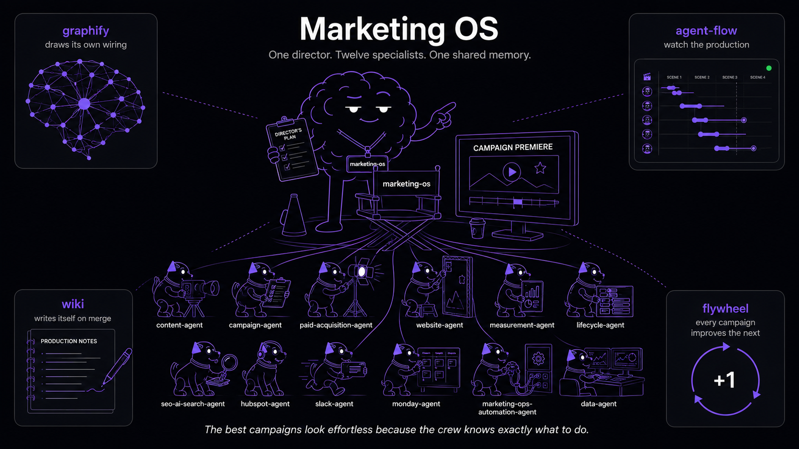
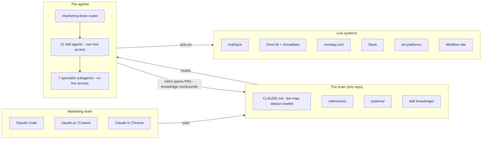
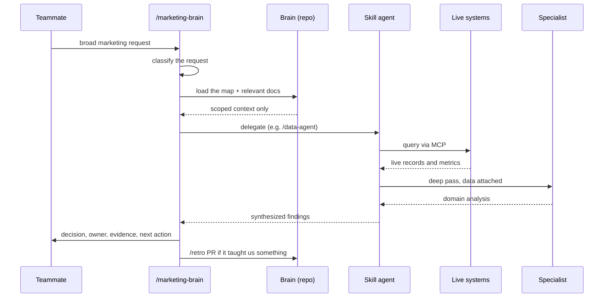
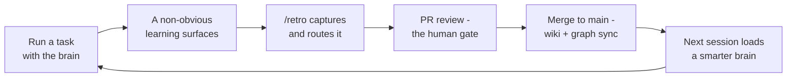
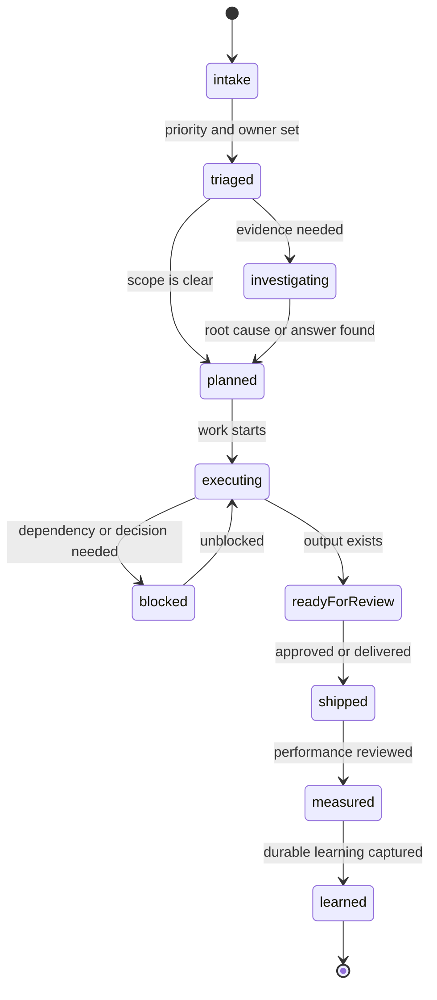

# Riverside Marketing OS - The Department Context

> The Marketing department's operating brain. A version-controlled knowledge base built for AI-first consumption, so Claude works as an operating partner instead of an isolated tool.



## What This Is

This repo is Riverside Marketing's **Marketing OS context**: a centralized, structured record of our systems, workflows, conventions, tribal knowledge, priorities, and sub-agent routing. It turns Claude from a blank-slate assistant into a partner that already knows how the department runs.

It serves Abel Grünfeld's whole org - Growth, Brand, Marketing (PMM / content / community / social), AI Marketing, and Growth Initiatives. Operational depth is currently deepest in Growth and Marketing Operations, where the brain originated; the other sub-orgs are documented for org context, cross-function routing, and attribution, and are onboarding into the same system.

**The goal:** every campaign, brief, and decision the OS touches makes the next one faster and sharper. One director agent (`marketing-brain`) coordinates twelve specialist sub-agents over one shared, self-improving memory. See `PHILOSOPHY.md` for why we built it this way and the flywheel that keeps it healthy.

Everything is structured for **progressive disclosure**: `CLAUDE.md` is always loaded, everything else loads only when the task needs it.

## What Each Team Leader Gets

The system is shared, but the payoff is personal. These are live use cases (every skill named exists in this repo today), with the benefit each leader buys.

| Leader | Everyday use cases | The payoff |
|--------|-------------------|------------|
| **Abel Grünfeld** (VP) | `/marketing-brain` operating brief across the department; attribution answers via `/rivermind:ask`; new hires onboard with `/team-intro` + [`docs/ACTIVATE.md`](docs/ACTIVATE.md) | A department memory that survives turnover, and visibility without another status meeting |
| **Nir Taranto** (Growth) | `/nir-monthly-report` (branded monthly board report, no chasing); `/nir-mql-live-report` (daily inbound demo-MQL DM, runs as a cloud routine); 250+ check paid audits, `/page-cro`, SEO/AI-search agent | Recurring reporting and channel audits run themselves; his leaders spend the time on decisions, not data pulls |
| **Raz Messing** (Brand) | `/riverside-brand-guidelines` + `/riverside-presentation` put every deck, doc, and page on brand by default; the full design system (Figma tokens, components, icons) loads into any build task | Brand consistency at scale without policing; the guidelines are executable, not a PDF nobody opens |
| **Sivan Mazuz** (Marketing) | `references/messaging/` (framework, 2026 brand story, voice-of-customer) loads into every external copy task; customer language from `/gong-calls-explorer`; funnel definitions from `/preop-data-intelligence` | Positioning has one source of truth; copy starts from validated messaging instead of memory |
| **Raz Navon** (Paid Acquisition) | `/paid-acquisition-agent` with live access to Google, Meta, LinkedIn, and Bing; 250+ check account audits; brand DNA, copy templates, and AI ad-image generation; `/page-cro` on the post-click funnel | Full-account audits and creative rounds in hours; budget calls made on data instead of gut |
| **Dor Druker** (Growth Channels) | `/campaign-agent` orchestrates paid, website, lifecycle, and content for any channel test; `/rivermind:ask` for channel performance; `/marketing-psychology` and copy templates for messaging | New channels tested at one-person speed, with a full stack behind every experiment |
| **Savion Ron Shemesh** (Creator Marketing) | Podcast, video, TikTok, and Instagram specialist subagents for creator formats and briefs; `/riverside-brand-guidelines` on every asset; performance answers from `/rivermind:ask` | Creator content ships on brand by default and gets measured like every other channel |
| **Hanan Amos** (Marketing Operations) | `/mops-standup` across the MOPs, Website Dev, and mvpGrow boards; `/hubspot-workflow-qa` on every workflow; `/invoice-inbox-to-monday` as a weekly cloud routine; `/health-check` + `/retro` keep the brain itself healthy | The automation backbone runs with QA guardrails, and the recurring chores are already cloud routines |

Why teams pick it: it **compounds** (learnings land as reviewed PRs, not tribal memory), it has **guardrails** (writes ask a human first, data comes from the validated Rivermind layer), it **onboards in a day** (the brain already knows the boards, channels, and systems), and there is **nothing to host** (plain markdown on managed Claude infrastructure).

## Quick Start

New teammate? See [`docs/ACTIVATE.md`](docs/ACTIVATE.md) to turn the brain on in three steps (and optionally start Agent Flow).

Already set up? Open Claude Code in this repo and say any of these:

| Say this | What happens |
|----------|-------------|
| "run the marketing OS" | Top-level operating brief: priorities, risks, owners, actions |
| "good morning" | Daily brief: tasks, team updates, what needs attention |
| "create a task" | Structured Monday task (Why / What / Done When) |
| "interview me" | Claude extracts your knowledge and commits it to the repo |
| "let's retro" | Captures learnings after any workflow |
| "health check" | Finds stale docs and knowledge gaps |
| "what skills do you have?" | Lists all available skills |

## Skills

| Skill | Trigger phrases | Description |
|-------|----------------|-------------|
| `marketing-brain` | "run the marketing OS", "triage marketing", "plan this campaign" | Top-level router that delegates to sub-agents and closes the operating loop |
| `good-morning` | "good morning", "morning brief", "catch me up" | Daily brief with tasks, team updates, and action items |
| `pm-story` | "create a task", "write a story", "document this task" | Structured task creation grounded in system context |
| `retro` | "let's retro", "capture what we learned" | Self-learning: captures knowledge, commits to repo |
| `health-check` | "health check", "stale docs" | Staleness detection for system docs and references |
| `curious-intern` | "interview me", "fill gaps", "brain dump" | Knowledge extraction interview to fill doc gaps |
| `team-intro` | "tell me about the team", "onboard me" | Team and project overview |
| `list-skills` | "what skills do you have", "list skills" | Show all available skills |
| `agent-builder` | "build an agent", "create a skill", "new skill", "deploy a routine" | Interviews you, then generates, validates, and deploys a lint-clean new skill/agent/routine |

Plus a registry of specialist sub-agents (data, HubSpot, Monday, Slack, paid acquisition, website, SEO/AI-search, lifecycle, content, campaign, measurement, marketing-ops automation). Start broad requests with `marketing-brain` and it routes to the right ones. Full task and sub-agent routing tables live in `CLAUDE.md`.

## Marketing Agents

A library of subagents under `.claude/agents/`, imported from [msitarzewski/agency-agents](https://github.com/msitarzewski/agency-agents) and invokable by name (e.g. "Use the SEO Specialist agent to…"). These are **generic, channel-specific templates** - not yet Riverside-tuned to our systems, brand, or data - so treat them as a starting library that complements the Riverside skills above. The China-market agents (Baidu, Douyin, Xiaohongshu, Weibo, Zhihu, Kuaishou, Bilibili, WeChat, livestream/podcast/e-commerce specialists, China localization, private-domain, and multi-platform publishing) were removed as out of scope for our markets.

### `Marketing Agents

| Agent | Specialty | When to Use |
|-------|-----------|-------------|
| [SEO Specialist](.claude/agents/marketing/marketing-seo-specialist.md) | Technical & content SEO | Organic search growth, technical audits, topic clusters, link authority |
| [AEO Foundations Architect](.claude/agents/marketing/marketing-aeo-foundations.md) | AI-engine optimization infrastructure | Make the site parseable/actionable for AI crawlers (llms.txt, structured markdown, agent discovery) |
| [Agentic Search Optimizer](.claude/agents/marketing/marketing-agentic-search-optimizer.md) | WebMCP / agent task completion | Audit whether AI browsing agents can complete tasks (book, buy, sign up) on your site |
| [AI Citation Strategist](.claude/agents/marketing/marketing-ai-citation-strategist.md) | AEO/GEO citation audits | Find why ChatGPT/Claude/Gemini/Perplexity cite competitors and fix the signals |
| [App Store Optimizer](.claude/agents/marketing/marketing-app-store-optimizer.md) | ASO & store conversion | Mobile-app discoverability, keyword/metadata, store-listing CRO |
| [Content Creator](.claude/agents/marketing/marketing-content-creator.md) | Multi-channel content | Editorial calendars, campaign copy, brand storytelling across channels |
| [Social Media Strategist](.claude/agents/marketing/marketing-social-media-strategist.md) | Cross-platform social | Multi-platform social campaigns and community/thought-leadership strategy |
| [LinkedIn Content Creator](.claude/agents/marketing/marketing-linkedin-content-creator.md) | LinkedIn thought leadership | Personal-brand/founder content and inbound via LinkedIn |
| [Instagram Curator](.claude/agents/marketing/marketing-instagram-curator.md) | Instagram aesthetics & growth | Grid/Reels strategy, visual brand, IG community + shopping |
| [TikTok Strategist](.claude/agents/marketing/marketing-tiktok-strategist.md) | TikTok virality | TikTok-native content, algorithm, trends, brand growth |
| [Twitter Engager](.claude/agents/marketing/marketing-twitter-engager.md) | X/Twitter engagement | Real-time engagement, threads, conversational brand-building on X |
| [X/Twitter Intelligence Analyst](.claude/agents/marketing/marketing-x-twitter-intelligence-analyst.md) | X research & trend intel | Trend detection, account monitoring, audience insights from public X signals |
| [Reddit Community Builder](.claude/agents/marketing/marketing-reddit-community-builder.md) | Reddit community marketing | Authentic subreddit engagement without tripping anti-promo norms |
| [Carousel Growth Engine](.claude/agents/marketing/marketing-carousel-growth-engine.md) | Automated carousel generation | Turn a URL into TikTok/IG carousels with a generate→verify→publish loop (gated publish) |
| [Video Optimization Specialist](.claude/agents/marketing/marketing-video-optimization-specialist.md) | YouTube optimization | Titles/thumbnails, retention, chaptering, video SEO and syndication |
| [Short-Video Editing Coach](.claude/agents/marketing/marketing-short-video-editing-coach.md) | Short-video post-production | CapCut/Premiere/Resolve editing, color, audio, captions, export specs |
| [Email Marketing Strategist](.claude/agents/marketing/marketing-email-strategist.md) | Lifecycle email & deliverability | Segmentation, lifecycle sequences, deliverability, post-MPP measurement |
| [PR & Communications Manager](.claude/agents/marketing/marketing-pr-communications-manager.md) | PR & crisis comms | Press releases, media pitches, crisis response, exec thought leadership |
| [Growth Hacker](.claude/agents/marketing/marketing-growth-hacker.md) | Experiment-driven growth | Viral loops, funnel CRO, finding scalable acquisition channels |
| [Global Podcast Strategist](.claude/agents/marketing/marketing-global-podcast-strategist.md) | Podcast growth (global) | Show positioning, audience growth, monetization on Spotify/Apple/YouTube |
| [Book Co-Author](.claude/agents/marketing/marketing-book-co-author.md) | Thought-leadership books | Turn founder notes and positioning into structured first-person chapters |

### `paid-media/`

| Agent | Specialty | When to Use |
|-------|-----------|-------------|
| [Paid Media Auditor](.claude/agents/paid-media/paid-media-auditor.md) | Multi-platform ad audits | 200+ checkpoint audit of Google/Microsoft/Meta accounts with prioritized fixes |
| [PPC Campaign Strategist](.claude/agents/paid-media/paid-media-ppc-strategist.md) | Search/Shopping/PMax architecture | Account structure, bidding, and budget at scale on Google/Microsoft/Amazon |
| [Paid Social Strategist](.claude/agents/paid-media/paid-media-paid-social-strategist.md) | Paid social (full-funnel) | Meta/LinkedIn/TikTok (+Pinterest/X/Snap) prospecting→retargeting programs |
| [Programmatic & Display Buyer](.claude/agents/paid-media/paid-media-programmatic-buyer.md) | Programmatic / display & ABM | GDN/DV360, trade desks, partner media, ABM display (Demandbase/6Sense) |
| [Ad Creative Strategist](.claude/agents/paid-media/paid-media-creative-strategist.md) | Ad copy & creative testing | RSA/asset-group copy, messaging, and creative testing across platforms |
| [Search Query Analyst](.claude/agents/paid-media/paid-media-search-query-analyst.md) | Search terms & negatives | Mine search-term reports, build negative-keyword architecture, cut waste |
| [Tracking & Measurement Specialist](.claude/agents/paid-media/paid-media-tracking-specialist.md) | Conversion tracking & attribution | GTM/GA4/CAPI/Insight Tag, server-side tracking, attribution accuracy |

## Systems We Own

| System | Doc |
|--------|-----|
| Marketing Brain (this repo + Marketing OS) | `systems/owned/marketing-brain.md` |
| Paid Acquisition | `systems/owned/paid-acquisition.md` |
| Marketing Website | `systems/owned/marketing-website.md` |
| HubSpot | `systems/owned/hubspot.md` |
| Omni BI | `systems/owned/omni-bi.md` |
| Marketing Ops Automation | `systems/owned/marketing-ops-automation.md` |

Reference systems we depend on but don't own (Rivermind, Agent Flow, the Marketing Operating Model) are in `systems/reference/`. See `systems/README.md` for doc templates, or say "teach me about [system name]" to write a new one.

## Department

- **VP:** Abel Grünfeld (reports to CEO Nadav Keyson)
- **Sub-orgs:** Growth (Nir Taranto), Brand (Raz Messing), Marketing (Sivan Mazuz), AI Marketing (John Tay), Growth Initiatives (Ruben Aknin)
- **Tools:** HubSpot, Omni BI, monday.com, Slack
- **Primary Slack:** `#growth-marketing-leaders`

See `references/team.md` for the full roster, Slack IDs, and reporting lines.

## How This Repo Works

```plaintext
CLAUDE.md (always loaded - the map)
  |
  +-- marketing-brain    (top-level router for broad/cross-system work)
  +-- references/     (stable lookup data: IDs, contacts, boards, design system)
  +-- systems/        (architecture maps of what we own and depend on)
  +-- .claude/skills/ (sub-agents and automated workflows)
       +-- knowledge/ (heavy reference content, loaded on demand within skills)
```

Claude loads only what's needed for the current task. The graph at `graphify-out/` and the auto-synced wiki give Claude a navigable map of the whole repo. Details in `PHILOSOPHY.md`.

## Tooling and navigation

Two tools sit alongside the OS. Neither does marketing work; they make the brain navigable and observable as it grows.

| Tool | What it does | Ownership |
|------|--------------|-----------|
| **Graphify** | Indexes the whole repo into a queryable knowledge graph (`graphify-out/`) with god nodes and community structure, so Claude answers "how does X relate to Y" without grepping every file. Auto-refreshes on every merge to `main`, so it tracks the repo with no manual upkeep. Trigger with `/graphify`. | Ours |
| **Agent Flow** | Live visualizer for Claude Code sessions - renders tool calls, sub-agent spawns, and returns as an interactive node graph. A developer and observability tool for whoever operates the brain; nothing in the Marketing OS depends on it. Run locally and opt-in. | Third-party (Apache-2.0), we consume it |

Graphify is owned supporting infrastructure: delete `graphify-out/` and the OS still runs, you just lose fast graph queries. Agent Flow is an optional local dev tool. Setup, wiring, and gotchas for Agent Flow live in [`systems/reference/agent-flow.md`](systems/reference/agent-flow.md); start it via [`docs/ACTIVATE.md`](docs/ACTIVATE.md).

## Architecture

> **Full integration reference:** [`docs/platform-integration.md`](docs/platform-integration.md) maps every connected platform and MCP server (with auth model and consumers), all systems, agents, subagents, orchestration, automation, and the source-file layout in one place.

### The platform at a glance

Four stages, one direction of flow, one loop back: the team talks to Claude, Claude loads the brain, the agents act on live systems, and what they learn lands back in the brain as a pull request. A Riverside-branded visual version of all the diagrams in this section lives at [`docs/marketing-os-data-flow.html`](docs/marketing-os-data-flow.html) (open locally in a browser).



### A request, end to end

What happens when someone asks the Marketing OS a broad question: the router classifies, loads scoped context, delegates to a skill agent that pulls live data, then hands the data to a specialist for the deep pass. Mutating writes (HubSpot, monday, Slack) pause for human approval unless a specific automation skill was invoked, and data questions go to Rivermind before any direct query.



### The learning flywheel

The loop that turns a context repo into a compounding brain. Every novel workflow ends with a captured learning, and every learning is a reviewed pull request, never tribal memory.



### Request routing

How the Riverside marketing agent routes broad marketing intent into specialist sub-agents, connected systems, work state, and the learning loop.

```mermaid
flowchart TB
  user["Marketing team request"]
  os["Riverside marketing agent"]

  user -->|"brief, triage, plan, investigate, execute, measure, learn"| os

  os --> classify["Classify request"]
  os --> context["Load relevant context"]
  os --> delegate["Delegate to sub-agents"]
  os --> synthesize["Synthesize recommendation"]
  os --> closeLoop["Close the loop"]

  context --> claude["CLAUDE.md"]
  context --> refs["references"]
  context --> systems["systems/owned"]
  context --> skills[".claude/skills"]

  delegate --> data["Data agent"]
  delegate --> measurement["Measurement agent"]
  delegate --> hubspotAgent["HubSpot agent"]
  delegate --> lifecycle["Lifecycle agent"]
  delegate --> mondayAgent["Monday agent"]
  delegate --> slackAgent["Slack agent"]
  delegate --> content["Content agent"]
  delegate --> paid["Paid acquisition agent"]
  delegate --> website["Website agent"]
  delegate --> seo["SEO and AI search agent"]
  delegate --> automation["Marketing ops automation agent"]
  delegate --> campaign["Campaign agent"]

  data --> omni["Omni BI"]
  data --> mixpanel["Mixpanel"]
  data --> snowflake["Snowflake"]
  data --> windsor["Windsor.ai"]

  measurement --> omni
  measurement --> hubspot["HubSpot"]
  measurement --> windsor

  hubspotAgent --> hubspot
  lifecycle --> hubspot
  automation --> hubspot

  mondayAgent --> monday["monday.com"]
  slackAgent --> slack["Slack"]
  content --> brand["Brand guidelines"]
  content --> docs["Docs, decks, copy"]

  paid --> googleAds["Google Ads"]
  paid --> meta["Meta"]
  paid --> linkedIn["LinkedIn"]
  paid --> bing["Bing"]
  paid --> windsor

  website --> web["riverside.com"]
  website --> monday
  seo --> gsc["Search Console"]
  seo --> ahrefs["Ahrefs"]
  seo --> web

  campaign --> paid
  campaign --> website
  campaign --> lifecycle
  campaign --> content
  campaign --> measurement

  synthesize --> decision["Decision"]
  synthesize --> owner["Owner"]
  synthesize --> evidence["Evidence"]
  synthesize --> nextAction["Next action"]

  closeLoop --> state["Operating state"]
  closeLoop --> approval["Approval if mutating"]
  closeLoop --> monday
  closeLoop --> slack
  closeLoop --> retro["Retro and repo learning"]

  state --> intake["intake"]
  state --> triaged["triaged"]
  state --> investigating["investigating"]
  state --> planned["planned"]
  state --> executing["executing"]
  state --> blocked["blocked"]
  state --> review["ready for review"]
  state --> shipped["shipped"]
  state --> measured["measured"]
  state --> learned["learned"]

  retro --> repo["marketing-brain repo"]
  repo --> context
```



### Operating-state loop

Every piece of work the agent touches moves through this lifecycle.



Source: [`docs/marketing-os-diagram.md`](docs/marketing-os-diagram.md).

## Adding to This Repo

- **New skill**: say "build an agent" or "create a skill" to run `/agent-builder` - it interviews you, generates a lint-clean `SKILL.md`, validates it, wires it into routing, and opens the deploy PR
- **New system doc**: say "teach me about [system name]" - Claude will interview you
- **Capture learnings**: say "let's retro" after any novel workflow
- **Check health**: say "health check" periodically to find gaps

## Adoption Guide

See `docs/QUICKSTART.md` for the full playbook: first 30 minutes, first week, first month, decision trees, and common pitfalls.

<details>
<summary>Git hooks setup</summary>

This repo includes a pre-commit hook for `gitleaks` (secret scanning):

```bash
git config core.hooksPath .githooks
```

The hook runs automatically if configured. If you don't have `gitleaks` installed, it will warn but not block commits.

</details>
