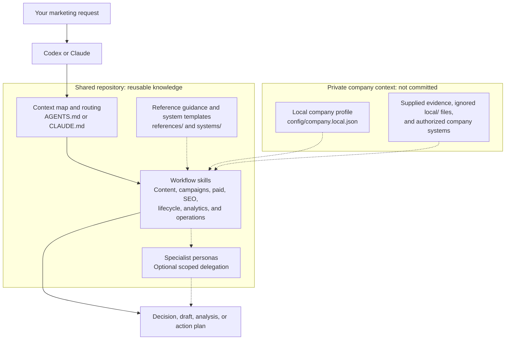
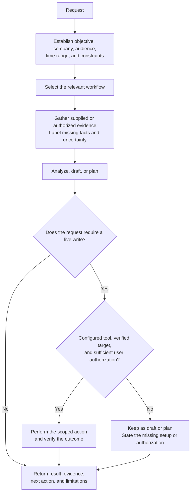
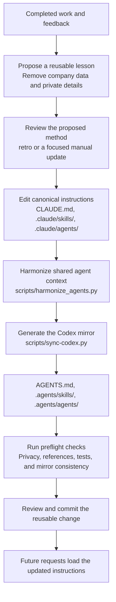

# Marketing Brain 2.0

A company-neutral marketing knowledge base for Codex and Claude. It keeps reusable
workflows, specialist agents, and quality checks separate from private company data.

## Start Here

1. Run `python3 scripts/company_config.py --init` to create your ignored local profile.
2. Fill in your company, audience, positioning, and the tools you actually use.
3. Run `python3 scripts/company_config.py --require-ready`.
4. Start with `/marketing-brain`, `/good-morning`, or `/setup`.

Without a configured company, skills can review supplied material and create drafts.
Live integrations and scheduled jobs are not enabled by this repository.

Reusable upstream material retains its attribution; see [Third-Party Notices](THIRD_PARTY_NOTICES.md).

## How the Brain Works

The brain is a library of instructions and reusable methods loaded by Codex or Claude.
It is not a background service: a request starts the work, and only relevant context
and workflows are loaded.

### 1. The Parts of the Brain



Solid arrows show the main path. Dotted arrows show supporting context or optional
specialist work. The root routing table selects the narrowest skill; broad requests
use `marketing-brain` to coordinate domains. Delegation depends on runtime permission.
Private context informs the work without becoming shared repository content.

### 2. From Request to Result



Writing a draft never grants permission to send, publish, spend, or change records.
Existing authorization is respected; missing connections are reported as limitations,
not interpreted as zero activity. See [Evidence Standards](references/evidence-standards.md).

### 3. How the Brain Improves



Learning means reviewed changes to files, not automatic model training or permanent
memory. Private reports remain in `local/` or approved company systems. The Claude
files are the source of truth; the Codex files are generated copies, not a second
knowledge base to maintain by hand.

## Layout

| Location | Purpose |
| --- | --- |
| `config/company.example.json` | Blank, versioned configuration contract |
| `config/company.local.json` | Private local company profile; never committed |
| `references/` | Neutral guidance for brand, product, evidence, and systems |
| `systems/` | Templates for documenting systems you actually use |
| `.claude/skills/` | Canonical reusable workflow skills |
| `.agents/skills/` | Generated Codex mirror |
| `.claude/agents/` | Specialist personas with a shared company-neutral contract |
| `evals/` | Synthetic workflow and writing checks |
| `local/` | Ignored private notes, exports, reports, and generated indexes |

See [New Company Setup](docs/NEW-COMPANY-SETUP.md) and
[Cleanup and Improvements](docs/CLEANUP-AND-IMPROVEMENTS.md).

## Maintain It

Edit the canonical skills, then regenerate the Codex mirror:

```sh
python3 scripts/harmonize_agents.py
python3 scripts/sync-codex.py
bash scripts/preflight.sh
```

Enable the staged-content privacy check with:

```sh
git config core.hooksPath .githooks
```

The same checks run in GitHub Actions. They catch known former-company identifiers,
private document links, common secret formats, broken references, and mirror drift.
They are regression checks, not proof that arbitrary content is free of sensitive data.

Keep employee records, customer data, reports, and credentials in approved private
systems. Reference those systems through the local profile. Never paste their data
into reusable skill instructions or eval fixtures.

## Cleanup Scope

The current files have been converted into a neutral template. Earlier Git commits
still retain the original import. Git history, external deployments, downloaded ZIPs,
local backups, GitHub artifacts, and externally installed skills are separate copies.
