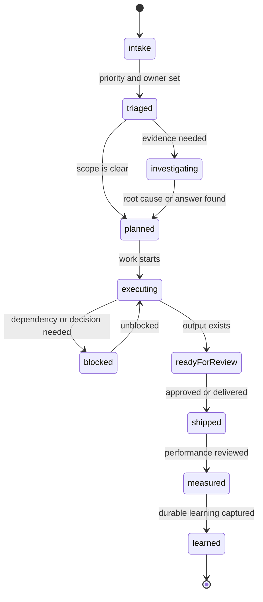

# Marketing OS Diagram

This diagram shows how the Riverside marketing agent routes broad marketing intent into specialist sub-agents, connected systems, work state, and the learning loop.

```mermaid
flowchart TB
  user["Marketing team request"]
  os["Riverside marketing agent"]

  user -->|"brief, triage, plan, investigate, execute, measure, learn"| os

  os --> classify["Classify request"]
  os --> context["Load relevant context"]
  os --> delegate["Delegate to sub-agents"]
  os --> synthesize["Synthesize recommendation"]
  os --> closeLoop["Close the loop"]

  context --> claude["CLAUDE.md"]
  context --> refs["references"]
  context --> systems["systems/owned"]
  context --> skills[".claude/skills"]

  delegate --> data["Data agent"]
  delegate --> measurement["Measurement agent"]
  delegate --> hubspotAgent["HubSpot agent"]
  delegate --> lifecycle["Lifecycle agent"]
  delegate --> mondayAgent["Monday agent"]
  delegate --> slackAgent["Slack agent"]
  delegate --> content["Content agent"]
  delegate --> paid["Paid acquisition agent"]
  delegate --> website["Website agent"]
  delegate --> seo["SEO and AI search agent"]
  delegate --> automation["Marketing ops automation agent"]
  delegate --> campaign["Campaign agent"]

  data --> omni["Omni BI"]
  data --> mixpanel["Mixpanel"]
  data --> snowflake["Snowflake"]
  data --> windsor["Windsor.ai"]

  measurement --> omni
  measurement --> hubspot["HubSpot"]
  measurement --> windsor

  hubspotAgent --> hubspot
  lifecycle --> hubspot
  automation --> hubspot

  mondayAgent --> monday["monday.com"]
  slackAgent --> slack["Slack"]
  content --> brand["Brand guidelines"]
  content --> docs["Docs, decks, copy"]

  paid --> googleAds["Google Ads"]
  paid --> meta["Meta"]
  paid --> linkedIn["LinkedIn"]
  paid --> bing["Bing"]
  paid --> windsor

  website --> web["riverside.com"]
  website --> monday
  seo --> gsc["Search Console"]
  seo --> ahrefs["Ahrefs"]
  seo --> web

  campaign --> paid
  campaign --> website
  campaign --> lifecycle
  campaign --> content
  campaign --> measurement

  synthesize --> decision["Decision"]
  synthesize --> owner["Owner"]
  synthesize --> evidence["Evidence"]
  synthesize --> nextAction["Next action"]

  closeLoop --> state["Operating state"]
  closeLoop --> approval["Approval if mutating"]
  closeLoop --> monday
  closeLoop --> slack
  closeLoop --> retro["Retro and repo learning"]

  state --> intake["intake"]
  state --> triaged["triaged"]
  state --> investigating["investigating"]
  state --> planned["planned"]
  state --> executing["executing"]
  state --> blocked["blocked"]
  state --> review["ready for review"]
  state --> shipped["shipped"]
  state --> measured["measured"]
  state --> learned["learned"]

  retro --> repo["marketing-brain repo"]
  repo --> context
```

## Operating State Loop

