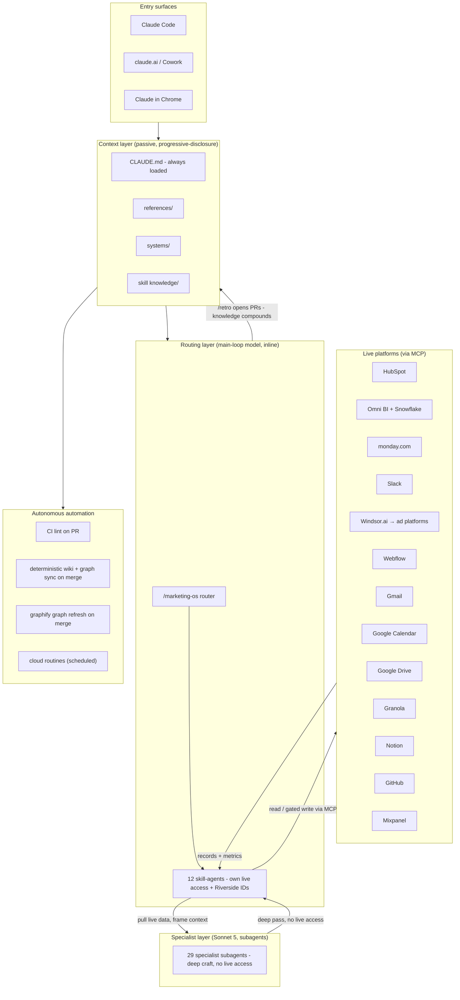
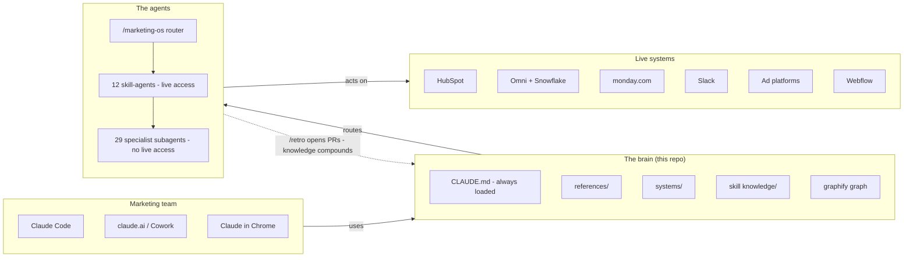
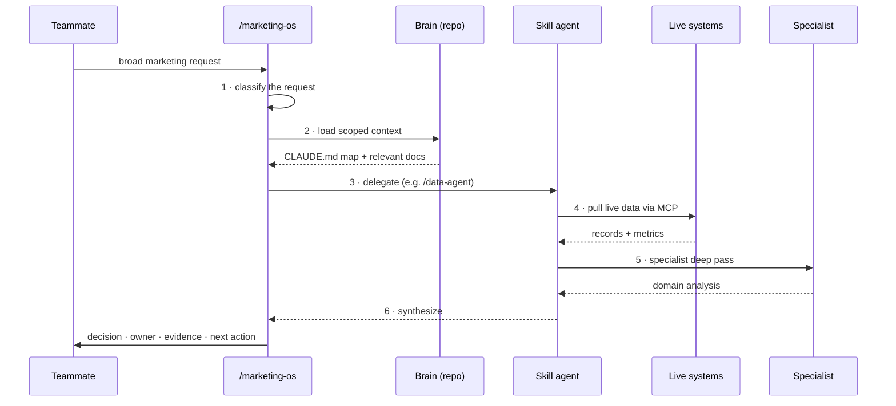
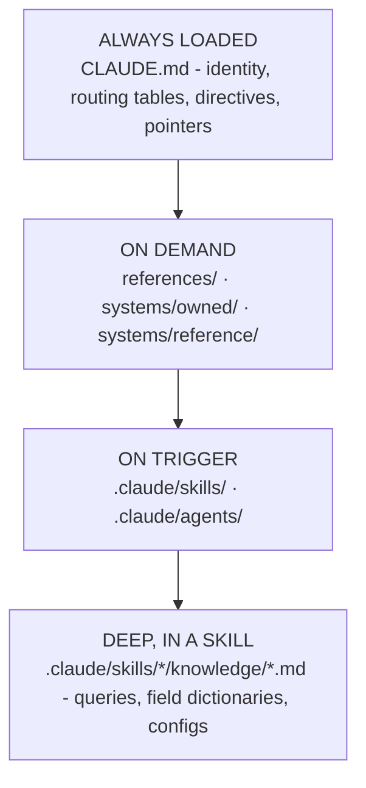
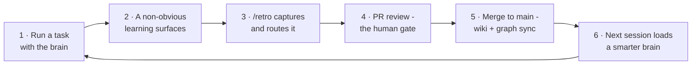
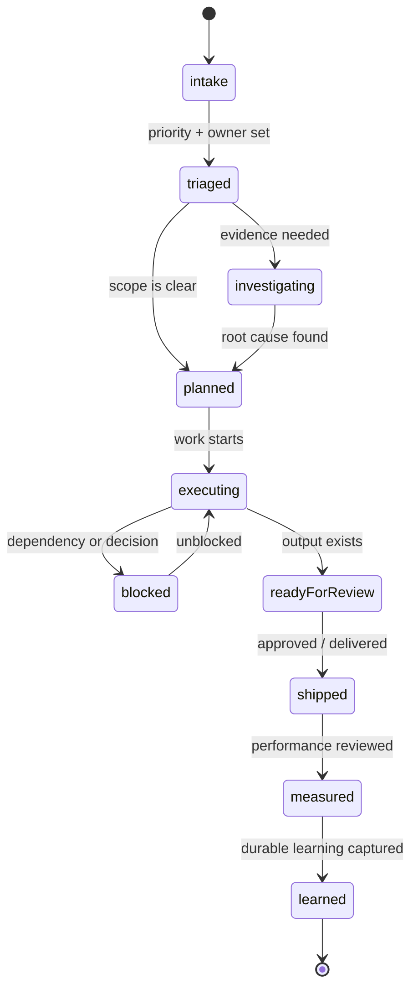

# Riverside Marketing OS - Platform Integration & System Design

> The single reference for how the Marketing OS is wired: every connected platform and MCP server, every system, every agent and subagent, the orchestration model, the automation, and the source-file map. If you want to know *what talks to what and where it lives*, this is the page.

**Scope:** integration surface + system design. It complements - does not replace - the per-system maps in `systems/`, the skill contracts in `.claude/skills/`, and the ID lookups in `references/`. Those remain the source of truth for detail; this page is the map that connects them.

**Generated:** 2026-07-16 from a full read of `CLAUDE.md`, `systems/**`, `references/**`, `.claude/skills/**`, `.claude/agents/**`, `.github/workflows/**`, and `.mcp.json`. Re-verify against `/list-skills` and the system docs when it drifts.

**Companion:** for the engineering-audience view of the same system - written in the register of the R&D ATA v2 execution plan, with a delta-vs-ATA mapping - see [`docs/marketing-os-technical-architecture.md`](marketing-os-technical-architecture.md).

**Convention reminder (`PHILOSOPHY.md`):** the repo holds *pointers, not copies*. Concrete IDs are consolidated here for navigability, but the live source of truth for each is the platform itself and the linked `systems/` or `references/` file. When an ID changes, fix it in its home file first.

---

## Table of contents

1. [System design at a glance](#1-system-design-at-a-glance)
2. [Platform & MCP connector inventory](#2-platform--mcp-connector-inventory)
3. [Owned systems](#3-owned-systems)
4. [Reference systems](#4-reference-systems)
5. [The routing layer - router + skill-agents](#5-the-routing-layer---router--skill-agents)
6. [Standalone workflow skills](#6-standalone-workflow-skills)
7. [Cloud routines (scheduled automations)](#7-cloud-routines-scheduled-automations)
8. [Builder, reference, and content-template skills](#8-builder-reference-and-content-template-skills)
9. [The specialist subagent layer](#9-the-specialist-subagent-layer)
10. [Orchestration & operating model](#10-orchestration--operating-model)
11. [CI, wiki, and knowledge-graph automation](#11-ci-wiki-and-knowledge-graph-automation)
12. [Concrete ID appendix](#12-concrete-id-appendix)
13. [Source-file map](#13-source-file-map)
14. [Known integration gaps & failure modes](#14-known-integration-gaps--failure-modes)
15. [Appendix - architecture & data-flow diagrams](#15-appendix---architecture--data-flow-diagrams)

---

## 1. System design at a glance

The Marketing OS is a **stack of narrowing filters**, not a flat catalog of tools. A request enters at the top, gets classified and scoped, and is delegated down through progressively more specialized layers until it reaches a live platform - then the result flows back up, is synthesized into a decision, and (if it taught us something) is captured back into the repo.

### Three layers

| Layer | What it is | Where | Model | Live access |
|-------|-----------|-------|-------|-------------|
| **Context** (passive) | The knowledge the agents read: the always-loaded map plus on-demand system maps, references, and skill knowledge | `CLAUDE.md`, `references/`, `systems/`, skill `knowledge/` | n/a | n/a |
| **Routing** (active) | The router + the `*-agent` skills that own live MCP access and Riverside IDs, plus standalone workflows and routines | `.claude/skills/**` | Whatever the session runs on, inline | **Yes** - HubSpot, Omni, monday, Slack, ad platforms, etc. |
| **Specialist** (active) | Deep-domain personas invoked by the skill-agents for the hard pass | `.claude/agents/**` | Sonnet 5 (`claude-sonnet-5`), pinned `model: sonnet` | **No** - carry the Riverside context block, defer all live writes to the routing layer |

### Why layered (the design rationale)

Tool-selection accuracy degrades once an agent sees more than ~10-15 tools at once. The brain is well past that (30+ skills plus hundreds of MCP tools), so it uses the standard mitigations: **progressive disclosure** (`CLAUDE.md` is a map, everything else loads on demand), **semantic routing** (the Task-Routing and Sub-Agent-Registry tables), **planning-based selection** (`/marketing-os` classifies then delegates), **gating** ("Rivermind first for data questions"), and **fallback chains** (Rivermind → `/data-agent`). See `systems/owned/marketing-brain.md` for the full mapping to the literature.

### The two rules that govern every integration

1. **Safety gate.** No mutating call to HubSpot, monday, Slack, ad platforms, or production workflows without user confirmation - *unless* a specific automation skill (a cloud routine) explicitly authorizes unattended writes.
2. **Rivermind first.** Every data/analytics question goes to `/rivermind:ask` before any direct Omni/Snowflake/Mixpanel query. Fall back to `/data-agent` only when Rivermind lacks coverage, and note the gap.

---

## 2. Platform & MCP connector inventory

Every platform the Marketing OS can reach, the MCP server that reaches it, how it authenticates, whether the OS reads or writes, which agents/skills consume it, and its home system doc.

### Directly connected via MCP

| Platform | MCP server (tool prefix) | Auth | OS usage | Primary consumers | Home doc |
|----------|--------------------------|------|----------|-------------------|----------|
| **HubSpot** | `mcp__HubSpot__*` | OAuth connector | Read + **gated write** | `hubspot-agent`, `lifecycle-agent`, `marketing-ops-automation-agent`, `preop-data-intelligence`, `nir-mql-live-report`, `hubspot-workflow-qa` | `systems/owned/hubspot.md` |
| **Omni BI** | `mcp__Omni_Analytics__*` (`pickModel`, `pickTopic`, `getData`, `askOmni`, `checkStatus`, `searchOmniDocs`) | connector | Read | `data-agent`, `measurement-agent`, `gong-calls-explorer` | `systems/owned/omni-bi.md` |
| **Snowflake** | `mcp__Snowflake__*` (`sql_exec_tool`, `docs_search`, `user_analytics`) | connector | Read (never write SQL) | `data-agent`, Rivermind | `systems/owned/omni-bi.md`, `systems/reference/rivermind.md` |
| **Mixpanel** | `mcp__Mixpanel__*` | connector | Read (has write tools; used read-only) | `data-agent` | `systems/owned/omni-bi.md` |
| **Windsor.ai** | `mcp__Windsor_ai__*`; pinned connector **`mcp__d2d9c91e-04a3-4128-b98e-5d252640ee02`** | connector | Read (write actions exist; not used) | `data-agent`, `paid-acquisition-agent`, `measurement-agent` | `systems/owned/paid-acquisition.md` |
| **monday.com** | `mcp__monday_com__*`; repo pins **`monday-api`** (HTTP MCP, `https://mcp.monday.com/mcp`) in `.mcp.json` | OAuth (needs per-session authorization) | Read + **gated write** | `monday-agent`, `pm-story`, `mops-standup`, `chief-of-staff`, `data-team-request`, `good-morning`, `nir-monthly-report`, `mops-backlog-review`, `p1-p2-followup`, `invoice-inbox-to-monday`, `hubspot-workflow-qa` | `references/monday_boards.md`, `systems/reference/data-team.md` |
| **Slack** | `mcp__Slack__*` | connector | Read + **gated write** (auto only for routines) | `slack-agent` + nearly every workflow and routine | `references/slack.md` |
| **Gmail** | `mcp__Gmail__*` | OAuth | Read + label/draft | `invoice-inbox-to-monday` | `.claude/skills/invoice-inbox-to-monday/` |
| **Google Calendar** | `mcp__Google_Calendar__*` | OAuth | Read + **write events** | `p1-p2-followup`, `chief-of-staff` | `.claude/skills/p1-p2-followup/` |
| **Google Drive** | `mcp__Google_Drive__*` | OAuth | Read + write | `chief-of-staff`, `nir-monthly-report`, growth-reporting flows | `references/growth-reporting.md` |
| **Granola** | `mcp__Granola__*` | connector | Read (meeting transcripts) | `chief-of-staff` | `references/granola-recipes.md` |
| **Mesh** | `mcp__Mesh__*` (`whoAmI`, `getMyCompanies`, `getMyVirtualCards`, `getMyRecentTransactions`, `getCardTransactions`, `getOrganizationContacts`); connector UUID `fbc4d1a3-0f69-4d02-bad7-a0438b2e73c8` | OAuth (needs per-session enablement; interactive only) | **Read-only** - all 6 tools are reads; transaction tools cover **every card the caller holds** | `mesh-expenditure-report` | `systems/reference/mesh.md` |
| **Notion** | `mcp__Notion__*` | connector | Read | operating-model context loads | `systems/reference/marketing-operating-model.md` |
| **Webflow** | `mcp__Webflow__*` (MCP 2.0, released 2026-07-21: most operations no longer need a Designer session; adds site analytics reports, forms + submissions, custom fonts, sitemap indexing, agent instructions, schema markup, asset folders/compression, site/page custom code; workspace permissions + audit logging enforced on every agent action) | connector | Read + write | `website-agent`, `seo-ai-search-agent` (locale publish queuing still uses Claude-in-Chrome, **not** the API - no queue-for-next-publish action exists) | `systems/owned/marketing-website.md` |
| **GitHub** | `mcp__github__*` + `gh` CLI + `git` | token / OAuth | Read + write (PRs, commits) | `agent-builder`, `retro`, `curious-intern`, `access-welcome`, all PR flows | `systems/owned/marketing-brain.md` |
| **Figma** | `mcp__Figma__*` | connector | Read + write | design-system extraction | `references/design-system/` |
| **Linear** | `mcp__Linear__*` | connector | Read + write | available; not yet wired into a marketing skill | - |
| **Claude Code Remote** | `mcp__Claude_Code_Remote__*` | session | Write (triggers, routines, PR watch) | cloud-routine scheduling, PR monitoring | - |
| **Chili Piper** | `mcp__chili-piper__*`; repo pins **`chili-piper`** (HTTP MCP, `https://fire.chilipiper.com/api/fire-edge/v1/org/mcp`) in `.mcp.json` | OAuth per person (Admin role); scoped API key only as a **local-scope** override | Read + **gated write** (scope any key read-only unless a flow needs to book) | newly added - no skill calls it yet; Chili Piper context today is prose in `hubspot-agent` (`*_cp` attribution), `page-cro`, `inbound-demo-reply` (booking links) | `systems/owned/hubspot.md` (the `*_cp` fields) |

> **On the Chili Piper MCP.** First-party server, maintained by Chili Piper's engineering team; it exposes the public org (Edge) API as tools - meetings, availability, concierge routers and logs, distributions, routing rules, users/teams, handoff. The committed entry is **URL-only, exactly like `monday-api`**: no credential in git, and each person authenticates themselves. Four things that cost time to discover:
>
> - **OAuth is the path for interactive Claude Code**, and it requires an **Admin** on the Chili Piper account (it authenticates the person, and the MCP needs org-wide permissions). No secret is stored anywhere in the repo or the environment. `claude mcp add --transport http chili-piper <url>` with no header, then trigger the browser login with `/mcp` in an interactive session. **Leave `headers` off entirely for this**: Claude Code disables the OAuth fallback whenever `headers.Authorization` is set (the MCP log says so in as many words), so a config carrying a key can only ever succeed with a valid key and will never fall back to a browser login. A registered server sits at `! Needs authentication` until that login completes - `claude mcp add` registers, it does not authenticate.
> - **A non-admin needs an Admin-issued key**, added as a **local**-scope override (`claude mcp add … --header "Authorization: Bearer <key>"`). Scope matters: Claude Code picks *one* definition and does not merge across scopes, and precedence is local > project > user. A **user**-scope entry is therefore silently shadowed by this committed project entry and will never take effect. Local scope binds to one directory, so a worktree does not inherit the main repo's override. Generating a key is Admin-gated; *holding* one is not.
> - **Do not put the key in `~/.zshrc` and expect header expansion to find it.** `${VAR}` in `headers` is expanded in the Claude Code process; a macOS desktop app launched from the Dock does not inherit your shell profile. An unset variable is not a hard failure either - the config loads, warns, and sends the literal `${VAR}`, which surfaces as a bare `401` rather than an obvious config error. (This is the difference from `MARKUP_API_KEY`, which is read by `scripts/markup_client.py` in a Bash subprocess that *does* load the profile.)
> - **GitHub repo secrets do not reach any of this.** They are available to GitHub Actions only, and no workflow here consumes a secret or runs a Claude agent. Cloud routines are Claude Code routines whose credentials come from their `environment_id` (see `references/change-control.md`), not from GitHub.
> - **Diagnose from the MCP log rather than guessing.** `~/Library/Caches/claude-cli-nodejs/<project-slug>/mcp-logs-chili-piper/*.jsonl` records the real HTTP status per connection attempt, with the token redacted, so it is safe to read and paste. **`401` vs `403` is the entire diagnosis:** `403` is a valid token missing a scope, fixed by editing the token's scopes in place; `401` means the token is not recognized at all, so scopes are irrelevant and adding them changes nothing. The usual cause of a `401` is a credential from the wrong place - Command Center → Integrations → Credentials has an **HTTP Auth** sub-tab sitting next to **API Access Tokens**, and only the latter works against this endpoint, while the older `api.chilipiper.com/marketing/...` REST API has its own separate credentials that also 401 here.
>
> Token scopes are editable in place without changing the token value, so a `403` for a missing scope is fixed by editing the token, not reissuing it. Official skills (meeting-inspector, no-show-analyzer, routing-audit, and ~17 more) ship separately at [`Chili-Piper/mcp-assets`](https://github.com/Chili-Piper/mcp-assets) and are **not** installed here.

> **On the two monday integrations.** The repo's `.mcp.json` declares one server, `monday-api` (HTTP, OAuth), and `.claude/settings.json` pre-approves two of its read tools (`get_sprints_metadata`, `get_board_items_page`). The broader `mcp__monday_com__*` connector exposes the full read/write surface used by the workflow skills. Both point at the same `riversidefm.monday.com` workspace. In a fresh non-interactive session `monday-api` must be authorized before its tools work.

### Referenced platforms with no direct MCP

These appear in the system docs as upstream data sources or platform-native tools; the OS reaches their data indirectly (through Windsor.ai, Snowflake, Omni, or the platform UI) rather than a dedicated MCP.

| Platform | Role | Reached via |
|----------|------|-------------|
| Google Ads, Meta, LinkedIn, Bing/Microsoft Ads | Paid channels | **Windsor.ai** connector |
| GA4, Google Search Console | Web analytics, organic search | **Windsor.ai** connector |
| Ahrefs | SEO backlink/keyword data | platform UI (SEO agent) |
| Convert Experiences | Website A/B + split-URL testing on riverside.com. **Department-wide** (not Growth-only; e.g. homepage tests) | platform UI; in-page JS from Webflow head code. Diagnose from the browser via `window.convert.data` / `_conv_v` - `systems/owned/convert-experiences.md` |
| Stripe, Segment, product events | Revenue & product usage | **Snowflake** → **Omni** |
| Hightouch | Reverse-ETL (Snowflake → HubSpot scores) | HubSpot side effects |
| n8n (`riverside.app.n8n.cloud`) | Analytics-owned reporting automations | Notion pointers (don't edit) |
| RevenueCat | Mobile subscription data | Snowflake models |
| Rivermind | Analytics-team data Q&A plugin | `/rivermind:ask` skills (consume Snowflake) |
| Markup.io | Stakeholder QA feedback on web pages (visual pins per page) | **Markup REST API v2** via `scripts/markup_client.py`, `MARKUP_API_KEY` (kept in macOS Keychain, exported from `~/.zshenv`; setup in the contract doc); consumed by `marketing-website-page-qa` (contract: `.claude/skills/marketing-website-page-qa/knowledge/markup-api.md`) |
| Backoffice Marketing Coupons API | Stripe coupons and promotion codes: list, create, switch codes off and on. **Only on Jonathan Galili's or Hanan Amos's request or approval** | REST at `api.riverside.fm/backoffice` via `curl`, `MARKETING_BACKOFFICE_API_KEY` (key file `~/.config/marketing-os/backoffice.key`); moves between coupons via `tools/promo-code-migration/` - `systems/reference/backoffice-coupons-api.md` |
| PagerDuty | On-call (optional morning-brief source) | optional MCP, disabled by default |

### Plugins & session config

- **Enabled plugins** (`.claude/settings.json`): `skill-creator`, `claude-md-management`, `slack` (all `@claude-plugins-official`).
- **Rivermind** is installed as its own plugin/workspace (`rivermind-plugin`), namespacing the `rivermind:*` skills.
- **Pre-approved tools** (no permission prompt): `Read`, `Edit`, `Write`, `Glob`, `Grep`, `Agent`, `Bash(git/ls/cat/cd/gh/jq/date *)`, and the two `mcp__monday-api__*` read tools.

---

## 3. Owned systems

Systems the Marketing department builds, operates, or maintains. Each has a full map in `systems/owned/`.

### Marketing Brain - `systems/owned/marketing-brain.md`
This repo + the Marketing OS agent layer. **Active / core.** No external MCP of its own; it is the router that reaches every other system through its sub-agents. Automation via GitHub Actions + the GitHub Wiki. Wiki generation and incremental Graphify document/code extraction are deterministic; richer model-assisted graph refreshes are optional. No Anthropic or Claude secret is required. Owns: the whole skill/agent registry and CI.

### Paid Acquisition - `systems/owned/paid-acquisition.md`
Google, Meta, LinkedIn, Bing ad accounts + reporting. **Active** (Raz Navon / Savion Ron Shemesh covering Growth Channels since Dor Druker's departure; last audited 2026-06-24). All platforms reached through the **Windsor.ai** connector `mcp__d2d9c91e-04a3-4128-b98e-5d252640ee02`; changes made in platform-native UIs. Consumers: `paid-acquisition-agent`, `data-agent`, `measurement-agent`.
- **Ad accounts:** Google Ads - Brand `561-273-9488`, Riverside.com `475-509-4241`, YouTube `879-418-1974`, Search V2 (dormant) `228-244-5778`; Meta - Riverside `250675469352903`, Riverside 2.0 (dormant) `697387924928899`; LinkedIn - Nadav's `506910541`; GA4 - riverside.com `329843929`; Bing - Riverside.com; Search Console - 7 properties.
- **Windsor slugs:** `google_ads`, `facebook`, `linkedin`, `bing`, `google_analytics`, `google_search_console`. Slack: `#marketing-growth-ppc-team`.
- **Integration gotchas:** Windsor `get_fields` for Google Ads overflows context (pass a targeted field list); always filter by Account ID (accounts blend); Google keyword field is `keyword_text`; Google `quality_score` is summed (not 1-10, pull from UI); Meta has no generic `conversions` (use action fields; some purchase/lead fields return NULL - instrumentation gap); LinkedIn lacks audience breakdowns + `cost_per_conversion` via Windsor; Bing legacy `conversions` deprecated → use `conversions_qualified`.

### Marketing Website - `systems/owned/marketing-website.md`
riverside.com pages, SEO, accessibility, localization, monitoring. **Active** (Web Developer Jonathan Ydov under Hanan from 2026-09-27; the Webflow agency Flow Ninja executes). Reached via **Webflow** (MCP 2.0 data tools for CMS/pages/SEO/forms/assets/analytics; Designer via Claude-in-Chrome only for locale publish queuing - the API has no queue-for-next-publish action), monday (Website Dev board `18397093471`), Slack, Ahrefs, GSC. Consumers: `website-agent`, `page-cro`, `seo-ai-search-agent`, `content-agent`, `webflow-locale-publish-queue`, `webflow-build-agent`, `webflow-accessibility-audit`, `webflow-link-checker`.
- **Slack:** `#website-dev` `C0AM2HQMY49`, `#marketing-website-monitoring` `C05FK3G82H4`, `#marketing-dev` `C0AA8HABQKG` (R&D/DevOps). `#website-accessibility` `C0AE8HFK7R7` is no longer used (2026-09-23).
- **Failure modes:** Cloudfront caching → intermittent 404s; DE-locale 301 chains / duplicate paths; careers navbar not auto-updated; check HubSpot events/UTMs/ChiliPiper before CRO launches.

### Convert Experiences - `systems/owned/convert-experiences.md`
Website A/B and split-URL testing on riverside.com. **Active**, and **used department-wide** - not a Growth-only tool; the homepage is a shared surface and tests on it come from across the org. Platform admin sits with the Marketing Website role (interim Jonathan Galili). No MCP: the script is installed via Webflow head custom code, and diagnosis is done in the browser (`window.convert.data`, `_conv_v`, `convert.currentData`).
- **Account / project:** `10042201` / `10042699`. Tracking script v1.5.2 (2026-08-30).
- **Failure modes (all silent):** `exists`/`doesNotExist` comparison operators declared but unimplemented → whole audience fails; any throwing condition is coerced to `false`; Site Area `matches` is exact string equality (query strings break it); audience is an entry gate only and is never re-evaluated after bucketing; Convert evaluates ~85ms before Segment loads, so vendor-cookie conditions read absent on a visitor's first pageview.

### HubSpot - `systems/owned/hubspot.md`
CRM, lifecycle, marketing attribution. **Active / high** (~2.4M contacts, ~22.5K Pre-Ops, ~36K deals; Jonathan Galili infra, Hanan strategy). Reached via **HubSpot MCP**; ingest from Webflow forms, ad-platform lead-gen sync, product events; behavior scores from Snowflake via Hightouch. Consumers: `hubspot-agent`, `lifecycle-agent`, `marketing-ops-automation-agent`, `measurement-agent`, `hubspot-workflow-qa`, `preop-data-intelligence`.
- **Portal / account:** `app.hubspot.com`, account **`9154210`**.
- **Pre-Op pipelines:** Agency(SMB) `29354026`, Enterprise `29152011`, Europe `89765536`. **Sales pipelines** (11 total): Agency New Sales `9297003`, Enterprise New Sales `9308023`, Europe New Sales `89892425`, Renewals `3711152`, Upsell `33402955`, Account Expansion `891525221`, Partnership & Channel `2662763`, Influencer `71445776`.
- **Failure modes:** product events overwrite Contact Last Touch Source (use Pre-Op Last Touch Source); unknown field names → `propertiesNotFound` (use `search_properties` first); product-synced timing fields are backfill snapshots (pull true dates from Snowflake `ANALYTICS.FS.USERS`); self-serve signups leaking into MQL + BD outreach (verified 2026-07-14); `query_crm_data` timezone/GROUP BY/BETWEEN quirks.

### Omni BI - `systems/owned/omni-bi.md`
Dashboards + reporting; source of truth for MRR, funnel, channel performance. **Active** (last reviewed 2026-06-25). **Omni MCP** on top of **Snowflake** (`RS Snowflake` model); raw SQL via **Snowflake MCP**. Data from Stripe, HubSpot, Segment, ad platforms (via Windsor), Gong. Consumers: `data-agent`, `measurement-agent`.
- **Instance:** `riverside.omniapp.co`. **Model:** `RS Snowflake`, ID **`48d89fd2-ce24-44e1-bfe5-f3e30334c6dc`** (the only model).
- **Topics:** `Daily Customer MRR`, `MQLs to SQLs to Deals`, `gong_calls`, `Marketing Funnel Analysis`, `Ad Conversion Funnel`, `omni_dbt_bi__marketing_growth_channel_analysis`, `users`, `Daily Product Usage Per User`, `Hubspot Companies`.
- **Snowflake tables:** `ANALYTICS.FS.USERS`, `ANALYTICS.BI.MARKETING_FUNNEL_ANALYSIS`, `ANALYTICS.BI.SIGN_UP_TO_SUBSCRIPTION_DATA`. Slack: `#marketing-growth-report-updates` `C0ASQBR8YNR`.
- **Failure modes:** `Daily Product Usage Per User` times out unfiltered (always filter by user/date); `pickTopic` returns closest match (verify `topicId`); Snowflake has no default schema (fully-qualify tables).

### Marketing Ops Automation - `systems/owned/marketing-ops-automation.md`
Lead routing, scoring, and the HubSpot ↔ ad platforms ↔ warehouse integrations. **Active / production impact.** HubSpot workflows + properties; ad-platform connectors; HubSpot→warehouse sync feeding Omni; product-event→HubSpot sync. Consumers: `marketing-ops-automation-agent`, `hubspot-agent`, `measurement-agent`, `pm-story`. Board: Marketing Operations Tasks `6257866754`; Slack `#mops-priority-room` `C0A9JUG9MPZ`.
- **Failure modes:** unclear workflow blast radius (identify trigger/downstream/rollback/owner first); reporting symptoms may be sync-freshness; self-serve → MQL auto-promotion leak.

### Self-Serve Lead Scoring (v3) - `systems/owned/self-serve-lead-scoring.md`
Scores every self-service signup, assigns tier, feeds ad platforms + lifecycle. **Active / high strategic** (Hanan; ~4.9-6.4M contacts). HubSpot calculated properties + custom-code workflow; source **Snowflake → Hightouch → HubSpot**; downstream to **Meta CAPI, Google Enhanced Conversions, TikTok Events API**, lifecycle workflows, in-product prompts, Omni.
- **Scoring props:** `self_serve_identity_score` (0-40), `ss_behavior_score` (0-60), `self_serve_composite_score` (0-100), `self_serve_lead_tier`, `quality_signup`; snapshot fields `*_at_24h` set by workflow "Score snapshot at 24h" (live 2026-06-29). Tier-threshold workflow `1785077505`.
- **Failure modes:** `signup_composite_score` broken (null for all contacts); MQL/BD leak (2,129 contacts in first 2 weeks of July); backward lifecycle moves silently ignored (clear then set); Hightouch behavior window effectively 0-48h.

---

## 4. Reference systems

Systems the OS depends on or integrates with but does **not** own. Maps in `systems/reference/`.

### Rivermind - `systems/reference/rivermind.md`
Analytics team's validated data-Q&A plugin over Snowflake. **Reference - we consume, never contribute.** The mandatory first stop for data questions (`/rivermind:ask`). Reached via `sql_exec_tool` MCP + bundled static business context (`.knowledge/context/`, read-only). Skills: `/rivermind:ask`, `/rivermind:run-pipeline`, `/rivermind:explore`, `/rivermind:export`, plus Release Radar monitors. If Snowflake is unreachable, Rivermind pauses (no local fallback).

### Agent Flow - `systems/reference/agent-flow.md`
Third-party (Apache-2.0) local visualizer of Claude Code sessions. **Reference / optional dev tool - nothing in the OS depends on it.** Local Node/pnpm app; Claude Code hooks → local forwarder → SSE relay. No auth (local only). We maintain only local `riverside-theme` / `riverside-ux` branches (never pushed upstream).

### Data Team - `systems/reference/data-team.md`
The Data Team (Business Operations org) runs analytics/data-infra requests on three monday boards in **their own workspace `1537478`**. **Reference - we're a requester.** Reached via **monday MCP** + Slack `#data-marketing` `C08283QUCNM`. Only sanctioned entry point: `/data-team-request`.
- **Boards:** 📝 Data requests (intake) `18399446834`; ⚙️ Data group - Main operation (execution) `18399485085`; Data group past Qs (closed-quarter archive) `18426192716`. Gotcha: "Prioritize" moves the item to the ops board under the same item ID, and closed quarters are moved again to the archive, where every Status reads `Backlog`. Track by item ID; for archived items the real status is only in the activity log.

### Mesh - `systems/reference/mesh.md`
Finance's corporate spend platform (cards, subscriptions, reimbursements, vendor payments). **Reference - we're a spender and a reader, read-only.** Reached via the `Mesh` OAuth connector (`fbc4d1a3-0f69-4d02-bad7-a0438b2e73c8`), which must be **enabled per session** (interactive OAuth, so no scheduled runs). Only entry point: `/mesh-expenditure-report`. Finance owns the category taxonomy, approvals, and card issuance; category disputes route to them, never remapped in a report.
- **Scope follows the cardholder (verified 2026-07-25):** 6 read tools; transaction tools return **every card the caller holds**, so coverage depends on whose account runs the report. **Nir holds Growth Marketing's cards department-wide**, so his run covers the department; an IC's run covers only their own cards. `companyRole: EMPLOYEE` / `canManageOrganization: false` governs org *administration*, not card readability. **Absolute limits:** `spendCategoryStatus` is a **flag**, not the category name; there is **no date-range parameter**; and there is no cardholder field, so live ownership is card level. A Finance export supplies category names and person-level attribution. `getOrganizationContacts` returns people, not spend.

### Backoffice Coupons API - `systems/reference/backoffice-coupons-api.md`
Platform's API over the Stripe coupon catalog: six endpoints to list and create coupons and to list, add, switch off and reactivate promotion codes. **Reference - we're a caller with one key; Platform Enablement owns the API (`#platform-enablement-requests`); open gaps are Linear ENB-1142.** **Access rule (2026-09-30):** used only when Jonathan Galili or Hanan Amos requests or approves the specific operation, reads included. Moving codes between coupons goes through `tools/promo-code-migration/` (pairs switch-off and create per code, canary first, ledger, rollback).
- **Gotchas:** Cloudflare 403 (1010) on Python's default client, so use `curl`; the list endpoint stops at 100 rows per coupon; UI exports carry `__typename`/`null` restriction fields the create call rejects; the gateway strips `X-User-Id`, so the audit trail shows `marketing-service@riverside.fm`; writes share 10 a minute across the key.

### Marketing Operating Model - `systems/reference/marketing-operating-model.md`
How Growth runs in 2026 (cadence, measurement stack, data model, bets). **Reference - most infra is analytics/data-team-owned in Notion.** Reached via **Notion connector**, **Rivermind**, Snowflake, plus pointers to n8n (`riverside.app.n8n.cloud`), Preset + Omni, HubSpot, Hightouch, ChiliPiper, Mixpanel, RevenueCat.
- **PQL model:** Snowflake `MACHINE_LEARNING.PQL.PQL_2O_OUTPUT` → HubSpot `pql_score` / `pql_job_title_score` via Hightouch (live threshold 0.6/0.6; doc says 0.9/0.9 - trust live). Attribution: dbt macro `get_utm_standardization`, `bi.daily_campaign_signup_attribution`. Escalation: Yaniv Barel (`U05CP58NCPL`). Reporting automations are analytics-owned n8n / eng-owned routines - **don't edit; escalate.** (Full Notion page-ID index in the appendix.)

---

## 5. The routing layer - router + skill-agents

The routing layer owns live MCP access and Riverside-specific IDs, runs inline on **the session's main-loop model**, and never delegates live writes to the specialist layer. A request enters here, live data is pulled here, mutations are gated here.

### The router

| Skill | Purpose | Live access | Writes |
|-------|---------|-------------|--------|
| `marketing-os` | Top-level operating agent - classifies intent, routes to sub-agents, synthesizes | None directly; orchestrates all | Delegates all mutations to sub-skills (each gates) |

### Skill-agents (domain routers)

| Skill | Platforms / MCP | Notable IDs | Read/Write |
|-------|-----------------|-------------|------------|
| `data-agent` | Omni, Snowflake, Mixpanel, Windsor.ai, Rivermind (first), Gong via Omni | Omni model `48d89fd2-…`; Windsor `mcp__d2d9c91e-…`; all ad-account IDs (single source) | Read-only (never writes SQL) |
| `hubspot-agent` | HubSpot MCP | 3 Pre-Op pipelines | Read + **gated write** (`manage_crm_objects`) |
| `monday-agent` | monday.com MCP | boards `6257866754`, `18396740865`, `18397093471` | Read + **gated write** |
| `slack-agent` | Slack MCP | team user IDs + channel IDs (see appendix) | Read + **gated write** (auto only for routines) |
| `campaign-agent` | None direct - routes to content/paid/website/lifecycle/measurement + specialists | - | Orchestrate; mutations via sub-skills |
| `content-agent` | Slack (send via slack-agent); routes to presentation/CRO/psychology/copytemplates; reads `references/messaging/` | - | Content gen; gated write via slack-agent |
| `lifecycle-agent` | HubSpot (via hubspot-agent); Email Marketing Strategist specialist | - | Read + gated HubSpot write |
| `measurement-agent` | Omni, Snowflake, Mixpanel, Windsor (via data-agent); HubSpot (via hubspot-agent) | - | Read-only |
| `paid-acquisition-agent` | Google/Meta/LinkedIn/Bing via data-agent + Windsor; paid-media specialists | defers to `systems/owned/paid-acquisition.md` | Read-only (never changes ad settings) |
| `marketing-ops-automation-agent` | HubSpot workflows, ad-platform syncs, warehouse; uses hubspot-workflow-qa | - | Read/diagnose; no direct production mutation |
| `seo-ai-search-agent` | GSC, Ahrefs, GA4, Omni (via data-agent), Webflow; SEO/AEO specialists | defers to `systems/owned/marketing-website.md` | Read + route |
| `website-agent` | Webflow/CMS, monday (Website Dev), Slack; uses page-cro, webflow-locale-publish-queue, webflow-build-agent, webflow-accessibility-audit, webflow-link-checker | defers to `systems/owned/marketing-website.md` | Triage/route; gated writes |

---

## 6. Standalone workflow skills

Interactive, on-demand workflows (not domain routers, not scheduled).

| Skill | Platforms | Key IDs | Writes |
|-------|-----------|---------|--------|
| `good-morning` | monday, Slack, GitHub (`gh pr list`), PagerDuty (optional) | `#growth-marketing-leaders` `C0A4Y0BD3BR` | Read-only (offers actions via AskUserQuestion) |
| `pm-story` | monday (create_item, updates), Slack (search), local git | boards `6257866754`, `18397093471`, `18413613511`; cols `status_11`, `status`, `person`, `priority_1` | **Write** - creates/updates monday items |
| `mops-standup` | monday (3 boards), Slack (4 channels) | boards `6257866754`/`18397093471`/`18413613511`/`18396740865`; `#marketing-internal` `C043B7GAMPC`, `#mops-team-internal` `C0AAQ15SVD3`, `#mops-priority-room` `C0A9JUG9MPZ`, `#website-dev` `C0AM2HQMY49` | Read brief; scheduled runs post to Slack |
| `gong-calls-explorer` | Omni BI | topic `gong_calls`, model `48d89fd2-…` | Read-only |
| `data-team-request` | monday (Data-team workspace `1537478`), Slack | intake `18399446834`, ops `18399485085`, archive `18426192716` (read); `#data-marketing` `C08283QUCNM` | **Write** - creates item on another team's board (confirm first) |
| `hubspot-workflow-qa` | HubSpot (MCP + **Claude in Chrome** DOM extraction), monday, Slack, Google Drive | board `6257866754`; tag `28385917` | **Write** - monday tickets + QA docs + Slack |
| `nir-monthly-report` | monday (2 boards), Slack (4 channels), docx skill | boards `18397093471`/`6257866754`; channels as in mops-standup | Read + **.docx file write** |
| `chief-of-staff` | monday (multiple), Slack (7 channels), **Google Calendar** (Nir's), **Granola**, Rivermind, Growth Reports + Drive | Growth Reports board `18395106969` (+ subitems `18395107181`); MOPs/Website/FY26 boards; 7 channel IDs; Nir `U07LETHMPAP` | Read-and-recommend; scheduled runs post **only to a confirmed Nir DM** (most sensitive surface) |
| `team-intro` | None (reads repo) | - | Read-only |
| `webflow-locale-publish-queue` | **Webflow Designer via Claude in Chrome** (browser, not API) | Designer staging URL | **Write** (browser) - queues CMS items; never runs the publish |
| `webflow-accessibility-audit` | Webflow MCP Data API (`data_pages_tool`, `data_element_tool`) | - | Read + **Write** - `set_attributes` fixes require confirmation |
| `webflow-link-checker` | Webflow MCP Data API (`data_pages_tool`, `data_element_tool`, `data_localization_tool`, `data_cms_tool`) - no Designer connection needed for any of it | - | Read + **Write** - CMS fixes require confirmation and a publish step before re-check; static-page fixes require confirmation via `set_link` (primary locale) or `update_static_content` (secondary locale) |

---

## 7. Cloud routines (scheduled automations)

Skills that run unattended on a schedule. These are the **only** skills authorized to write to live platforms without per-item confirmation. Most commit a dedupe ledger back to git for durable idempotency.

| Routine | Cadence | Platforms | Key IDs | Idempotency | Writes |
|---------|---------|-----------|---------|-------------|--------|
| `access-welcome` | Daily | GitHub (`gh api`), Slack, git | repo `riversidefm/marketing-brain`; Hanan `U0A3HCFE90S` | ledger `.claude/skills/access-welcome/tracking.md` | Slack DMs + ledger commit (auto sanctioned) |
| `nir-mql-live-report` | Daily (prior-day window) | HubSpot (search), Slack, git | Pre-Op pipelines `29354026`/`29152011`/`89765536`; portal `9154210` | ledger `.claude/skills/nir-mql-live-report/tracking.md` | Read HubSpot; **write** Slack DM + commit |
| `invoice-inbox-to-monday` | Weekly (Sun, Asia/Jerusalem) | Gmail, monday, Slack, curl (PDF), git | board `18390740532`; Emailed-items group `group_mm1fdkmn` (never touched); Hanan `U0A3HCFE90S` | ledger `.claude/skills/invoice-inbox-to-monday/tracking.md` | **Write** - monday items + PDFs + Slack DM + commit |
| `p1-p2-followup` | Weekly (Sun ~08:00) | monday (3 boards), Google Calendar, Slack (via slack-agent) | IDs in `.claude/skills/p1-p2-followup/knowledge/config.md`; Hanan `U0A3HCFE90S`; calendar colorIds 9/6 | in-calendar event markers `[p1p2-followup v1 \| item:… \| week:…]` | **Write** - calendar events + Slack DM |
| `mops-backlog-review` | Monthly (+ suggested by good-morning/mops-standup after day 22) | monday (2 boards) | MOPs `6257866754` (Backlog `new_group45625`, On Hold `group_mky6rv54`); Website Dev `18397093471` groups | none (audit) | **Write** (gated) - column changes + moves after confirm |
| `referrer-lookup` (routine mode, "Referrer lookup daily sweep") | Sun-Thu 10:45 `CRON_TZ=Asia/Jerusalem` | Slack, HubSpot (read), monday (read) | partnerships group DM `C0C0UNPKMHN`; Nir `U07LETHMPAP`; boards in `.claude/skills/referrer-lookup/knowledge/config.md` | lookback window since last run + skip threads with replies + Slack one-draft-per-channel | **Draft only** - one Slack draft in the first alert's thread, never sent |

Scheduling and PR-watching run through the `Claude_Code_Remote` MCP (triggers/routines).

---

## 8. Builder, reference, and content-template skills

### Builder / meta (maintain the brain)

| Skill | Purpose | Platforms | Writes |
|-------|---------|-----------|--------|
| `agent-builder` | Interview → generate → validate → register → draft-PR a new skill/agent/routine | local repo, git/GitHub, `.claude/skills/agent-builder/scripts/validate_skill.py`; edits `CLAUDE.md` + registry | **Write** - new skill files + registry + PR |
| `curious-intern` | Knowledge-extraction interview to fill doc gaps | local repo, git, memory (prefs only) | **Write** - edits docs, PR |
| `retro` | Capture learnings into the repo after a workflow | local repo, git | **Write** - repo edits / PR |
| `health-check` | Scan context for staleness / template drift | local repo | Read-only (presents findings) |
| `list-skills` | Live-render the skills list from the directory | local repo | Read-only |
| `setup` | Onboarding wizard that fills template placeholders | local repo, git | **Write** - edits, commits, may self-delete |
| `granola-recipe-builder` | Interview → paste-ready Granola recipe | reads `references/team.md`; saves `references/granola-recipes.md` + PR | **Write** (repo file + PR) |

### Reference skills (knowledge, not live access)

| Skill | Purpose | Notes |
|-------|---------|-------|
| `preop-data-intelligence` | Authoritative Pre-Op data dictionary + KPI logic (MQL/SQL/attribution) | The de-facto HubSpot schema doc; portal `9154210`, Pre-Op pipelines, Pre-Opp creation workflow `1819472043` |
| `page-cro` | CRO frameworks for website pages | references GSC, HubSpot, ChiliPiper, Clay, Typeform, Webflow conceptually |
| `riverside-brand-guidelines` | Brand colors/type/tone | references `references/design-system/` |
| `riverside-presentation` | Build Riverside-branded `.pptx` | produces file output |
| `marketing-psychology` | Behavioral science applied to marketing | read-only |
| `linkedin-best-practices-2026` | LinkedIn strategy/algorithm knowledge | read-only |
| `graphify` | Turn a repo into a knowledge graph (codebase Q&A) | outlier: local FS + optional Gemini/Neo4j; touches no marketing platform |

### Content-template skills (CopyTemplates headline library)

Nine LLM-only scaffolds (external author Shlomo Genchin; built for the Cowork/Code desktop app; owned by Creator Marketing). They touch **no marketing platform and no MCP server** - the only I/O is a local context_copytemplates file on the author's machine plus visiting the product website for research. Single-technique: `alliteration-`, `antithesis-`, `metaphor-`, `personification-copytemplates`. Master (multi-technique) batches: `boring-but-works-master-`, `humor-master-`, `numbers-master-`, `phrase-play-master-`, `point-of-view-master-copytemplates`.

---

## 9. The specialist subagent layer

Deep-domain personas in `.claude/agents/`, invoked by the routing-layer skill-agents for the hard pass. Pinned to **`model: sonnet`** (execution layer). They carry a shared Riverside context block (`<!-- riverside-harmonized -->`, canonical `.claude/agents/RIVERSIDE_CONTEXT.md`) but have **no live system access** - they receive data pulled by the skill-agent and return analysis. `marketing-os` must **not** route to them directly.

### `marketing/` specialists

| Agent | Model | Tools | Harmonized | Owning skill-agent(s) |
|-------|-------|-------|-----------|------------------------|
| AEO Foundations Architect | sonnet | All | Yes | `/seo-ai-search-agent` |
| AI Citation Strategist | sonnet | All | Yes | `/seo-ai-search-agent` |
| Agentic Search Optimizer | sonnet | All | Yes | `/seo-ai-search-agent` |
| SEO Specialist | sonnet | WebFetch, WebSearch, Read, Write, Edit | Yes | `/seo-ai-search-agent` |
| Email Marketing Strategist | sonnet | All | Yes | `/lifecycle-agent` (+ `/hubspot-agent`) |
| Content Creator | sonnet | WebFetch, WebSearch, Read, Write, Edit | Yes | `/content-agent` |
| LinkedIn Content Creator | sonnet | All | Yes | `/content-agent` |
| TikTok Strategist | sonnet | All | Yes | `/content-agent`, `/campaign-agent` |
| Instagram Curator | sonnet | All | Yes | `/content-agent`, `/campaign-agent` |
| Twitter Engager | sonnet | All | Yes | `/content-agent`, `/campaign-agent` |
| X/Twitter Intelligence Analyst | sonnet | All | Yes | `/content-agent`, `/campaign-agent` |
| Social Media Strategist | sonnet | WebFetch, WebSearch, Read, Write, Edit | Yes | `/content-agent`, `/campaign-agent` |
| Carousel Growth Engine | sonnet | All | Yes | `/content-agent`, `/campaign-agent` |
| Video Optimization Specialist | sonnet | All | Yes | `/content-agent`, `/campaign-agent` |
| Global Podcast Strategist | sonnet | All | Yes | `/content-agent`, `/campaign-agent` |
| PR & Communications Manager | sonnet | All | Yes | `/content-agent`, `/campaign-agent` |
| Growth Hacker | sonnet | WebFetch, WebSearch, Read, Write, Edit | Yes | `/marketing-os`, `/measurement-agent`, `/data-agent`, `/campaign-agent` |
| App Store Optimizer | sonnet | All | Yes | `/marketing-os` (as-needed) |
| Book Co-Author | sonnet | All | **No** | none - archive candidate |
| Short-Video Editing Coach | sonnet | All | **No** | none - archive candidate |
| Reddit Community Builder | sonnet | All | **No** | none - archive candidate |

### `paid-media/` specialists (all owned by `/paid-acquisition-agent`)

| Agent | Model | Tools | Harmonized |
|-------|-------|-------|-----------|
| Paid Media Auditor | sonnet | WebFetch, WebSearch, Read, Write, Edit, Bash | Yes |
| PPC Campaign Strategist | sonnet | WebFetch, WebSearch, Read, Write, Edit, Bash | Yes |
| Paid Social Strategist | sonnet | WebFetch, WebSearch, Read, Write, Edit, Bash | Yes (also `/campaign-agent`) |
| Programmatic & Display Buyer | sonnet | WebFetch, WebSearch, Read, Write, Edit, Bash | Yes |
| Search Query Analyst | sonnet | WebFetch, WebSearch, Read, Write, Edit, Bash | Yes |
| Ad Creative Strategist | sonnet | WebFetch, WebSearch, Read, Write, Edit, Bash | Yes |
| Tracking & Measurement Specialist | sonnet | WebFetch, WebSearch, Read, Write, Edit, Bash | Yes |
| Conversion Psychology Specialist | sonnet | WebFetch, WebSearch, Read, Write, Edit | Yes (fuses `/page-cro` + `/marketing-psychology`) |

> **Harmonization:** 26 of the 29 marketing/paid-media specialists carry the Riverside context block. The three unharmonized (Book Co-Author, Short-Video Editing Coach, Reddit Community Builder) are flagged archive candidates in `.claude/agents/README.md`.

---

## 10. Orchestration & operating model

Source: `.claude/skills/marketing-os/SKILL.md`.

### Request classification
Every request is classified into one of seven intents, which sets the operating mode: **brief · triage · investigate · plan · execute · measure · learn**.

### Operating-state lifecycle
Work moves through explicit states: `intake → triaged → investigating → planned → executing → blocked → ready for review → shipped → measured → learned`. State ownership is fixed by system: **monday** = work state, **Slack** = discussion/outbound, **HubSpot + Omni** = funnel/lifecycle/attribution evidence, the **repo** = durable knowledge.

### Model-selection policy
- **Planning stays on the session's main-loop model** - the orchestrator and all `*-agent` skills run inline on it. Classification, routing, planning, cross-system investigation, and final synthesis live here ("where judgment and trade-offs live").
- **Execution runs on Sonnet 5** - the specialist subagents in `.claude/agents/**`, pinned via `model: sonnet`. Deep well-scoped work: specialist passes, drafting, asset prep, mechanical state changes. When spawning a subagent directly, pass `model: sonnet` explicitly.
- **Escalation:** if an execution pass turns out to need real judgment (ambiguous strategy, risky/irreversible call), pull it back up to the orchestrator.

### Two-layer delegation
Request → `/marketing-os` (or a skill-agent) → skill-agent pulls live Riverside data and frames the PLG/SLG context → invokes the specialist subagent (Sonnet) for the deep pass → skill-agent/orchestrator synthesizes → surfaces any mutating action for confirmation. The full owner→specialist map lives in `.claude/agents/README.md` (mirrored in §9).

### Delegation contract
Every sub-agent result is normalized before it reaches the user: **Intent / Context loaded / Evidence / Recommendation / Owner / Operating state / Approval needed / Risks or gaps.** Raw sub-agent data is converted into an operating recommendation, never dumped.

### Approval / safety gates
- Never mutate HubSpot, monday, Slack, ad platforms, or production workflows without confirmation - unless a specific automation skill authorizes it.
- Draft outbound Slack/email content before sending.
- Name the source and its limitation before recommending from analysis.
- Use `pm-story` for task creation, not direct monday writes.

### Output contracts (by intent)
- **Brief:** "What Needs Attention" + "Recommended Next Actions"
- **Triage:** table of Item / Priority / Owner / State / Why
- **Plan:** Goal / Workstreams / Owners / Success Metrics / Risks / First 3 Actions
- **Investigation:** Answer / Evidence / Likely Cause / Recommended Action / Gaps
- **Execution closeout:** Done / Changed / Verification / Next

The loop always closes with a decision, owner, state, evidence, and next action - and suggests `/retro` when something non-obvious was learned.

---

## 11. CI, wiki, and knowledge-graph automation

Three autonomous processes keep the brain healthy and its generated views in sync. Source: `.github/workflows/`, `docs/wiki-sync-automation.md`.

### Team Context Lint - `.github/workflows/team-context-lint.yml`
Runs on any PR touching `systems/**`, `references/**`, `.claude/skills/**`, `.claude/agents/**`, `evals/**`, `CLAUDE.md`, or the scripts it invokes. Fails the PR if: a skill lacks `---`/`name:`/`description:` frontmatter; `scripts/lint_agents.py` finds a subagent that is unscoped, off-model, unregistered, or missing a harmonized block; `scripts/harmonize_agents.py --check` finds a hand-edited managed block; `scripts/eval_routing.py` finds a routing eval case that no longer resolves to a skill on disk (a duplicate, or a malformed line); any unfilled uppercase double-brace placeholder token remains (repo-wide grep, excluding `_example`, `setup/`, `starter/`, `graphify-out/`, `node_modules`); or a binary/packaged file (`*.zip`, `*.plugin`, `*.tar.gz`, `*.jar`) sits in the repo root.

The eval step is the one that reports without gating: description-overlap findings come back as warning annotations rather than failures, because TF-IDF overlap is a proxy for what a router keys on, not a prediction of it. Judging whether a flagged overlap actually misroutes is `/skill-eval`'s job. See `docs/skill-evals.md`.

### Wiki + Graph Sync - `.github/workflows/doc-agent-on-merge.yml`
Fires when a PR merges into `main` and supports manual reconciliation. Two stages are each split into a read-only build job and a model-free commit job:
- **Wiki:** `wiki-build` runs deterministic `scripts/sync_wiki.py`, which maps changed files to wiki pages, regenerates navigation/catalogs, and prepends to the wiki's Recent Changes page; `wiki-commit` applies and pushes the patch.
- **Graph:** `graph-build` runs deterministic incremental `scripts/sync_graph.py`, then rebuilds `graphify-out/graph-explorer.html`; `graph-commit` applies and pushes only `graphify-out/`.

**Security model:** build jobs have `contents: read` and run deterministic generators with no model credentials. Separate commit jobs hold write tokens, checkouts use `persist-credentials: false`, PR titles are treated as data, and `graph-commit` rejects patches outside `graphify-out/`.

**Controls:** `skip-wiki` / `skip-graph` PR labels; only merges into `main` trigger it; bot merges ignored (no loop).

### gitleaks pre-commit - `.githooks/pre-commit`
Opt-in local secret scanning (`git config core.hooksPath .githooks`).

---

## 12. Concrete ID appendix

All integration IDs, consolidated for navigability. Source of truth remains each home file.

### HubSpot (portal `9154210`)
- **Pre-Op pipelines:** Agency(SMB) `29354026`, Enterprise `29152011`, Europe `89765536`.
- **Sales pipelines:** Agency New Sales `9297003`, Enterprise New Sales `9308023`, Europe New Sales `89892425`, Renewals `3711152`, Upsell `33402955`, Account Expansion `891525221`, Partnership & Channel `2662763`, Influencer `71445776`.
- **Workflows:** tier-threshold `1785077505`; Pre-Opp Creation [2026 build] flow `1819472043`; "Score snapshot at 24h" (live 2026-06-29).
- **Score fields:** `self_serve_identity_score`, `ss_behavior_score`, `self_serve_composite_score`, `self_serve_lead_tier`, `quality_signup`; snapshots `composite_score_at_24h`, `icp_score_at_24h`, `behavior_score_at_24h`, `lead_tier_at_24h`, `score_24h_captured_at`. Canonical leak-case contact `234337455378`.

### Omni / Snowflake
- Omni instance `riverside.omniapp.co`; model `RS Snowflake` = `48d89fd2-ce24-44e1-bfe5-f3e30334c6dc`.
- Topics: `Daily Customer MRR`, `MQLs to SQLs to Deals`, `gong_calls`, `Marketing Funnel Analysis`, `Ad Conversion Funnel`, `omni_dbt_bi__marketing_growth_channel_analysis`, `users`, `Daily Product Usage Per User`, `Hubspot Companies`.
- Snowflake tables: `ANALYTICS.FS.USERS`, `ANALYTICS.BI.MARKETING_FUNNEL_ANALYSIS`, `ANALYTICS.BI.SIGN_UP_TO_SUBSCRIPTION_DATA`; PQL `MACHINE_LEARNING.PQL.PQL_2O_OUTPUT`.

### Windsor.ai / ad platforms
- Connector `mcp__d2d9c91e-04a3-4128-b98e-5d252640ee02`; slugs `google_ads`, `facebook`, `linkedin`, `bing`, `google_analytics`, `google_search_console`.
- Google Ads: Brand `561-273-9488`, Riverside.com `475-509-4241`, YouTube `879-418-1974`, Search V2 dormant `228-244-5778`.
- Meta: Riverside `250675469352903`, Riverside 2.0 dormant `697387924928899`. LinkedIn: Nadav's `506910541`. GA4: `329843929`.

### monday.com (workspace `riversidefm.monday.com`, id `6001561`)
- **Marketing:** Marketing Operations Tasks `6257866754`; FY26 MKT Planning `18396740865`; Website Development `18397093471`; HubSpot Projects // Eyal mvpGrow `18413613511`; Invoices and Payments `18390740532`; Growth Marketing Reports `18395106969` (subitems `18395107181`, Growth Channels workspace `13382295`).
- **Data-team workspace `1537478`:** Data requests (intake) `18399446834`; Data group Main operation `18399485085`; Data group past Qs (archive) `18426192716`.
- Key columns (MOPs Tasks `6257866754`): `status`, `status_11` (Type), `priority_1` (Priority), `status_18` (Stage), `color_mkzspv3r` (Bucket), `person` (Owner), `short_text01ee10v7` (HubSpot URL). Full column/status/group ID maps in `references/monday_boards.md` and each skill's own tracking or config file (for example `.claude/skills/ticket-hygiene/knowledge/config.md`).

### Slack (workspace `riversidefm.slack.com`)
- `#growth-marketing-leaders` `C0A4Y0BD3BR` (private, Nir's reports only), `#mops-priority-room` `C0A9JUG9MPZ`, `#website-dev` `C0AM2HQMY49`, `#website-accessibility` `C0AE8HFK7R7` (no longer used), `#marketing-website-monitoring` `C05FK3G82H4`, `#marketing-growth-report-updates` `C0ASQBR8YNR`, `#marketing` `C0280QR6KH6`, `#marketing-growth-ppc-team` `C08SC6DHZ6E`, `#marketing-internal` `C043B7GAMPC`, `#mops-team-internal` `C0AAQ15SVD3`, `#data-marketing` `C08283QUCNM`.
- User IDs: Nir `U07LETHMPAP`, Hanan `U0A3HCFE90S`, Jonathan Galili `U06NC1VQN7R`, Savion `U09340B5HCM`, Erika `U06R47T4ASJ`, Raz `U0A31DAME0G`, Ayelet `U08V687FYFM`, Yaniv Barel `U05CP58NCPL`. (Dor Druker `U09R2APCAUU` departed 2026-08-04 - do not message.)

### Convert Experiences (A/B testing)
- Account `10042201`; project `10042699`. Tracking script `https://cdn-4.convertexperiments.com/js/10042201-10042699.js` (v1.5.2 as of 2026-08-30).
- Dashboard `https://app.convert.com/accounts/10042201/projects/10042699/`; experience URLs `.../experiences/<experienceId>/summary`.
- Registered domains: `riverside.com`, `stg.riverside.com`, `riverside.fm`, `riversidefm-design.webflow.io`, `riversidefm-design-com-domain-staging.webflow.io`.
- **Known vendor defect:** comparison operators `exists` (13) / `doesNotExist` (14) are declared in the shipped config but unimplemented; conditions using them fail silently. Full failure-mode list: `systems/owned/convert-experiences.md`.

### Google Drive (Growth reporting)
- `Growth marketing Reports/` `1K18G3elXvPK5FycgIhBNE46l95nGvC3D`; `Year 2026/` `1xQIBx2jTl3BVHW7GgR2Q9kjW-GCRPn9T`; `Weekly/` `1K_hciYjUVcnkr42hDGnCrMrMt_FKgwko`; `Monthly/` `1594yhoxl2PO19bspOXWW2dkxMQQtRqFm`; top-level shared `1MByB7bkM6bsN59Ujx5cW5pkQY_yXmvly`. (Month/week subfolder IDs rotate - don't hardcode.)
- **The Drive connector is create/read/copy only - no in-place content or cell edit.** To "add a column to" or otherwise update an existing Google Sheet, you can't edit it in place; create a new file with `create_file` (`contentMimeType: text/csv` auto-converts to a native Google Sheet - UTF-8 umlauts and emoji survive the conversion). You also can't write into a sheet owned by someone else or in a folder you lack write access to (`canAddChildren:false`) - a created file lands in the runner's own Drive root. Tell the user it's a new enriched copy, not an edit of the original, and offer to let them paste the delta back.
- **A formatted Google Sheet has to arrive as ODS, not xlsx.** CSV converts but carries no formatting at all, so a CSV sheet is the unstyled floor, not the deliverable. The connector **refuses xlsx→Sheets outright** (`Invalid conversion requested`, before it reads a byte of the file), and it refuses an ODS containing a `styles.xml` part (`Unable to convert uploaded content`). What works: build the workbook as ODS carrying **only** `mimetype`, `content.xml`, `settings.xml` and `META-INF/manifest.xml`, put every style in `content.xml`'s `<office:automatic-styles>`, and drop `style:parent-style-name="Default"` along with the `styles.xml` that would have defined it. That survives with cell fills, borders, fonts, column widths, wrapping, merges, hyperlinks, `<table:database-ranges>` filter buttons and `settings.xml` frozen panes intact. Skip conditional formatting and data validation - Google's ODS importer drops them silently, so bake outcome colours in as static fills and say so. Neither LibreOffice (`soffice` is installed but cannot load *any* xlsx in this sandbox) nor `odfpy` (no wheel) is available to generate the ODS, so hand-roll the XML with `zipfile` - write `mimetype` first and **stored, not deflated**. Worked example and the bisect that found it: 2026-09-07 `/tools/` page migration.
- **To see what a person changed in a .docx they edited in Google Docs, diff the file, not Drive's text export.** A `.docx` opened in Google Docs stays a `.docx` (Office-compatibility mode, `rtpof=true` in the URL), and `read_file_content` flattens it: table cells merge across line breaks (`Week 1Sep 27 to Oct 1`), and header rows can come back shifted a column. Read the real file instead. If the user runs Drive for desktop, it is already on disk under `~/Library/CloudStorage/GoogleDrive-<email>/My Drive/`; copy it out and run `python3 scripts/docx_diff.py <sent>.docx <edited>.docx`, which diffs paragraph by paragraph and table row by table row, plus hyperlink targets and the image count. That turns "review my edits" into an exact change list. Each change is then either an edit for that doc only or a fact to route into the repo. Verified 2026-09-23 on the Marketing Website onboarding doc, where the diff found nine changes, several of them facts the knowledge base did not have.

### Notion (operating-model pages)
Full page-ID index lives in `systems/reference/marketing-operating-model.md`. Key ones: Marketing PQL Planning `37e97be2-38ae-8016-83c8-f0a210a66347`; Metrics Handbook index `37597be2-38ae-81b7-bde8-cce5f27d26bd` (§7 Marketing `37597be2-38ae-8130-a7c5-ea25780620ed`); Marketing Funnel Automation `37b97be2-38ae-808a-afc0-d59e40501f3d`; OO Modeling Spec v5 `36397be2-38ae-8160-bca0-df9dbaefbb2d`.

---

## 13. Source-file map

Where every piece of the system lives.

| Concern | Path |
|---------|------|
| Always-loaded map + directives | `CLAUDE.md` |
| Philosophy & principles | `PHILOSOPHY.md` |
| Owned system maps | `systems/owned/*.md` |
| Reference system maps | `systems/reference/*.md` |
| System doc templates | `systems/README.md` |
| Team roster / contacts | `references/team.md`, `references/other_teams.md` |
| Slack IDs | `references/slack.md` |
| monday board/column/group IDs | `references/monday_boards.md` |
| Growth reporting (Drive, taxonomy) | `references/growth-reporting.md` |
| Messaging / brand voice | `references/messaging/**` |
| Design system (Figma extraction) | `references/design-system/**` |
| Agent-prompting principles | `references/agent-prompting.md` |
| Granola recipes | `references/granola-recipes.md` |
| Router + skill-agents + workflows + routines | `.claude/skills/*/SKILL.md` |
| Branded .docx tooling (build, render, diff, screenshot) | `scripts/riverside_docx.py`, `scripts/render_docx.sh`, `scripts/docx_diff.py`, `scripts/web_screenshot.sh` |
| Heavy skill knowledge (loaded on demand) | `.claude/skills/*/knowledge/**`, `.claude/skills/*/tracking.md`, `.claude/skills/*/config.md` |
| Specialist subagents | `.claude/agents/marketing/*.md`, `.claude/agents/paid-media/*.md` |
| Shared subagent context (canonical) | `.claude/agents/RIVERSIDE_CONTEXT.md` |
| Subagent registry + two-layer model | `.claude/agents/README.md` |
| Deterministic wiki generator | `scripts/sync_wiki.py` |
| Routing eval suite | `evals/routing.jsonl`, `evals/README.md` |
| Deterministic eval tier | `scripts/eval_routing.py` |
| Eval design + rationale | `docs/skill-evals.md` |
| Evidence + source-conflict standards | `references/evidence-standards.md` |
| MCP server pin (monday-api) | `.mcp.json` |
| Harness permissions + plugins | `.claude/settings.json` |
| Env var template | `.env.example` |
| CI lint | `.github/workflows/team-context-lint.yml` |
| Wiki + graph sync | `.github/workflows/doc-agent-on-merge.yml` |
| Wiki-sync docs | `docs/wiki-sync-automation.md` |
| Architecture diagrams | `docs/marketing-os-diagram.md`, `docs/marketing-os-data-flow.html`, `architecture.html` |
| Adoption / activation | `docs/QUICKSTART.md`, `docs/ACTIVATE.md` |
| Knowledge graph (generated) | `graphify-out/` |
| **This document** | `docs/platform-integration.md` |

---

## 14. Known integration gaps & failure modes

Consolidated from the system docs. These are the places the integration surface is fragile or incomplete.

| Area | Issue |
|------|-------|
| **Routing** | Routing accuracy is unmeasured - no benchmark for "request → correct skill" (e.g. `/pm-story` vs `/data-team-request`, or direct API calls bypassing a skill). Report misroutes via `/retro`. |
| **monday auth** | In a fresh non-interactive session the `monday-api` HTTP MCP needs OAuth authorization before use; the `.claude/settings.json` allowlist only covers two read tools. |
| **Windsor / Google Ads** | `get_fields` overflows context (250k-500k+ chars) - always pass a targeted field list; always filter by Account ID; `quality_score` is summed (pull 1-10 from the UI); keyword field is `keyword_text`. |
| **Windsor / Meta** | No generic `conversions`/`cost_per_conversion`; some purchase/lead action fields return NULL - a pixel/CAPI instrumentation gap needing owner follow-up. |
| **Windsor / LinkedIn & Bing** | LinkedIn lacks audience breakdowns + `cost_per_conversion` via Windsor; Bing legacy `conversions` deprecated → use `conversions_qualified`. |
| **HubSpot** | Product events overwrite Contact Last Touch Source (use Pre-Op Last Touch Source); wrong field names → `propertiesNotFound` (use `search_properties`); product-synced timing fields are snapshots (pull true dates from Snowflake); `query_crm_data` timezone/GROUP BY/BETWEEN quirks. |
| **HubSpot / scoring** | Self-serve signups leaking into MQL + BD outreach (verified 2026-07-14, ~2,129 contacts in early July); `signup_composite_score` broken; backward lifecycle moves silently ignored. |
| **Omni** | `Daily Product Usage Per User` times out unfiltered; `pickTopic` returns nearest match (verify `topicId`); Snowflake has no default schema (fully-qualify tables). |
| **Website / Webflow** | No API/MCP action to queue a locale for next site publish (item-publish goes live immediately; some Designer-only items invisible to API locale queries) → Designer via Claude-in-Chrome; re-verified against MCP 2.0 (2026-07-21). Cloudfront caching causes intermittent 404s; DE-locale 301 chains. |
| **Data-team board** | "Prioritize" button duplicates onto the ops board (doesn't move); intake status goes stale; no `board_relation` between the two boards. |
| **Operating model** | Two attribution windows (7-day vs 30-day) and two scoring models (self-serve vs PQL 2.0) coexist - don't conflate; PQL live threshold (0.6/0.6) differs from the doc (0.9/0.9) - trust live. Reporting automations are analytics-owned n8n / eng-owned routines - escalate, don't edit. |
| **Docs hygiene** | Stale docs cause confident-but-wrong answers; run `/health-check`. Knowledge saved to memory instead of the repo benefits only one person - always route to the repo. |

---

## 15. Appendix - architecture & data-flow diagrams

The figures from the *Riverside Marketing OS* deck's appendix, reproduced here so the reference is self-contained. They render natively on GitHub and in the wiki.

### A. The platform at a glance
Four stages, one direction of flow, one loop back: the team talks to Claude, Claude loads the brain, the agents act on live systems, and what they learn returns to the brain as a pull request.

*Around this flow: CI lint on every PR, deterministic wiki + graph sync on every merge, and scheduled cloud routines with no human at the keyboard.*

### B. A request, end to end
The router classifies, loads scoped context, delegates to a skill-agent that pulls live data, then hands the data to a specialist for the deep pass.

- **Safety rule:** any mutating write along the way (HubSpot changes, monday updates, Slack sends) pauses for human approval first - unless a specific automation skill was invoked.
- **Data rule:** data questions go to Rivermind first; a skill-agent only falls back to direct Omni or Snowflake when Rivermind lacks coverage.

### C. Progressive disclosure - what loads when
A session starts with one file and pulls depth only when the task needs it.

*Result: sessions start instant, context stays scoped, and 30+ skills coexist without drowning the router.*

### D. The learning flywheel
Every learning is a reviewed pull request, never tribal memory.

*The rule that keeps it honest: team and system knowledge goes to the repo via PR; personal memory holds only individual preferences.*

### E. Operating state - how work moves
Every piece of work the OS touches moves through one state loop, from intake to a captured learning.

### F. Capability roadmap - four horizons

| Horizon | Theme | What the department unlocks |
|---------|-------|-----------------------------|
| **Now · here** | Foundation live | Daily brief, structured tasks, multi-platform ad audits (250+ checks), self-serve data Q&A, sub-agent routing, living system docs, funnel/Pre-Op intelligence |
| **Next quarter** | The operating loop | Campaign orchestration (brief → launch → tracking → readout), automated weekly readouts, lifecycle journeys (MQL→SQL, nurture, win-back), spend pacing + wasted-spend alerts |
| **6 months** | Runs the rhythm | Cross-system investigations without hand-holding, proactive anomaly flags in the brief, self-serve data for every marketer, brand-consistent content on demand |
| **12 months** | A compounding moat | Institutional memory that survives turnover, day-one onboarding, one consistent source of truth, the model replicated across other Riverside teams |

*Source: the "Riverside Marketing OS" deck (Goal & capability roadmap, June 2026).*

---

*Maintained under the flywheel: when the integration surface changes, update the home file first, then reconcile this map (or run `/retro`). The wiki + graph regenerate automatically on merge.*
